**Source of truth:** This document describes the currently implemented architecture. If it conflicts with assumptions elsewhere, verify against the actual source code before making changes.

# MayaVI (Maya) — Technical Architecture

Status: derived strictly from the code/config present in this repository snapshot.
Where behavior could not be verified from code, it is marked **[UNVERIFIED]**.
Where something is known-future/aspirational (from project notes, not code), it is marked **[PLANNED]**.

---

## 1. System Overview

Maya is a local-first, single-user Windows desktop voice assistant with a 3D VRM avatar
front-end. It is two cooperating processes:

- **Backend** — Python 3 `asyncio` application (`main.py` + `core/`, `brain/`, `services/`, `skills/`,
  `config/`). Owns audio capture, wake-word/VAD, STT, intent classification, skill dispatch,
  LLM orchestration, TTS synthesis, mood/context/memory state, and a WebSocket server.
- **Frontend** — browser/Electron-hosted Three.js scene (`frontend/js/`) rendering a VRM avatar.
  Pure WebSocket client: it has no direct access to the backend's Python state and reacts only
  to messages it receives.

The two communicate over a single WebSocket connection (`ws://localhost:8765` by default,
`config.ws_host`/`config.ws_port`). There is no REST API; all backend→frontend and
frontend→backend traffic verified in code is this one socket.

```mermaid
flowchart LR
    subgraph OS["Windows Desktop"]
        Mic[("Microphone")] --> Listener
        Speakers[("Speakers (local mode)")]
    end

    subgraph Backend["Python asyncio backend (main.py)"]
        Listener["core/listener.py\nSilero VAD + wake word"]
        Transcriber["core/transcriber.py\nGoogle STT"]
        Queue["core/queue_manager.py\nasyncio.Queue"]
        Processor["core/processor.py"]
        Intent["brain/intent_engine.py\nPyTorch+TF ensemble"]
        Router["brain/router.py"]
        Skills["skills/*"]
        LLM["services/llm/llm_service.py\nOllama streaming"]
        Lifecycle["services/llm/ollama_lifecycle.py\nkeep_alive + turn diagnostics"]
        Context["brain/conversation.py\nContextManager"]
        VectorStore["brain/vector_store.py\nSQLite"]
        Mood["core/mood.py"]
        Behavior["core/behavior_engine.py"]
        ExprLib["core/expression_library.py\nexpressions.json"]
        Speaker["core/speaker.py\nKokoro TTS"]
        WS["services/ws_server.py\nwebsockets server"]
        State["core/state.py\nFSM"]
    end

    subgraph FrontendJS["Frontend (Three.js, browser/Electron)"]
        WSClient["frontend/js/websocket.js"]
        Avatar["frontend/js/avatar.js"]
        ExprComposer["frontend/js/expression-composer.js"]
        Gaze["frontend/js/gaze-controller.js"]
        LifeMotion["frontend/js/life-motion-controller.js"]
        AnimCtrl["frontend/js/animation-controller.js"]
        ExprCtrl["frontend/js/expression-controller.js"]
    end

    Mic --> Listener --> Transcriber --> Queue --> Processor
    Processor --> Intent --> Router
    Router --> Skills
    Router --> LLM
    LLM --> Lifecycle
    LLM <--> Context
    Context <--> VectorStore
    Processor --> Mood
    LLM --> Mood
    Skills --> Speaker
    LLM --> Speaker
    Speaker --> Behavior --> WS
    LLM --> Behavior
    Behavior --> ExprLib
    WS <-->|WebSocket JSON + base64 audio| WSClient
    WSClient --> Avatar
    WSClient --> ExprComposer --> ExprCtrl
    Avatar --> AnimCtrl
    Avatar --> Gaze
    Avatar --> LifeMotion
    Speaker -.-> Speakers
```



---

## 2. Runtime Flow — Voice Command Path

### 2.1 Capture → transcription

1. `core/listener.py` opens a `sounddevice.InputStream` at `config.audio.sample_rate` (16 kHz
   mono). Frame size is clamped to ≥512 samples (Silero VAD's minimum: `sample_rate/frame_samples > 31.25`).
2. Every frame is always fed to `WakeWordDetector.feed_frame()` (`core/wake_word.py`), even while
   `MayaState.SLEEPING` — it is the only thing active during sleep.
3. While **not** sleeping, frames also go through Silero VAD (`torch.hub.load("snakers4/silero-vad")`).
   Speech-probability > 0.5 starts an utterance; `config.audio.silence_ms` (default 800 ms) of
   sub-threshold frames ends it. A pre-roll buffer (`pre_roll_ms`, default 200 ms) is prepended.
4. On utterance end, `Listener` invokes `on_speech(audio)` (wired in `main.py`) via
   `asyncio.run_coroutine_threadsafe` (the audio callback runs on a non-asyncio thread).
5. `main.py::on_speech` snapshots whether Maya `was_speaking` (for barge-in), transcribes via
   `core/transcriber.py` (`speech_recognition.recognize_google`, blocking call run in executor;
   **requires internet** — no offline STT fallback verified), then:
   - if `was_speaking` and the text contains a wake phrase (`core/wake_word.contains_wake_word`),
     triggers `state.interrupt()` (barge-in) — **talking over Maya without her name does not
     interrupt her**, it queues normally.
   - if text matches `_SLEEP_TRIGGERS` (`go to sleep`, `sleep`, `goodbye`, `bye`, `stop listening`),
     sets state to SLEEPING and speaks a goodbye line directly (bypasses the queue).
   - otherwise: `queue_manager.put(text)`.

### 2.2 Wake word

`WakeWordDetector` (`core/wake_word.py`) buffers ~2 s of audio only while `state.is_sleeping()`,
periodically runs Google STT on that window, and fires `on_wake()` if any of
`compute_wake_triggers(config.wake_word)` (e.g. `"maya"`, `"hey maya"`, `"hello maya"`,
`"hi maya"`, `"yo maya"`) is found. `on_wake` (`main.py`) sets state IDLE and speaks
`"I'm here {user}. How can I help?"`.

### 2.3 Command queue

`core/queue_manager.py` is a single bounded `asyncio.Queue` (maxsize=10). All transcribed
commands are serialized through one worker loop (`QueueManager.run()`), guaranteeing Maya
never overlaps responses regardless of how fast the user speaks. A full queue silently drops
new items (logged as a warning).

### 2.4 Processing a command

`core/processor.py::Processor.handle(item)`:
1. Sets state PROCESSING, broadcasts `state:processing` and the user transcript over WS.
2. `ConversationManager.add_user(text)` — writes into `brain/memory.py`'s in-process rolling
   window (`max_entries=50`).
3. `IntentEngine.classify(text)` → `{intent, target, confidence, raw, model}`.
4. `context_manager.observe_user_turn(text, intent)` — updates conversation state (topic, phase,
   entities, decisions, open loops) — **does not** write to conversation history itself.
5. `Router.dispatch(intent, text)` — looks up `intent["intent"]` in a static dict mapping to a
   skill coroutine or `llm_query`; unknown intents fall back to the LLM.
6. If the skill's return value is not `ALREADY_SPOKEN`, the response is added to conversation
   memory, broadcast as a transcript, and spoken via `Speaker.speak()` (with a wave animation
   fired via `on_audio_start` when intent is `greet`, or the skill-resolved animation when
   `intent["action"]` is set by `perform_action`).
7. Broadcasts `state:idle` + a mood-baseline `behavior` packet. Exceptions are caught, logged,
   and Maya returns to IDLE gracefully (no crash propagation to the queue worker).

---

## 3. Intent Classification (`brain/intent_engine.py`)

- **Dual-model ensemble**: a PyTorch BiLSTM+Attention model and a TensorFlow 1-D CNN, both
  trained on the same `TRAINING_DATA` (hand-labelled utterance→intent pairs, several hundred
  examples across ~40 intents). Final class = argmax of the **averaged softmax** of both models.
- Vocabulary is a simple whitespace/regex tokenizer (`_tokenize`) with `<PAD>`/`<UNK>`; models are
  trained on bag-of-token-id sequences padded/truncated to `_MAX_LEN=30`.
- **Auto-retrain**: a SHA-256 fingerprint of `TRAINING_DATA` is persisted
  (`models/training_hash.txt`); on startup, a mismatch triggers a full retrain automatically
  (no manual step required). `train_intent.py` remains for a full manual wipe + test report.
- **Guards that bypass the ML models entirely** (checked in this order before ML inference):
  1. Dismissal guard — exact match against `_DISMISSAL_PHRASES` (`stop`, `nah`, `never mind`, …).
  2. Presence/arrival guard — regex `_PRESENCE_RE` (e.g. "I'm here now", "just got back") forces
     `smalltalk`, added specifically because the ML models spuriously associate "now"/"here" with
     `get_time`/`get_date`.
  3. Action-word guard — `nod|giggle|sigh|shrug|wink` (+ `wynk` STT misheard variant) forces
     `perform_action` regardless of confidence.
  4. Keyword-first guard for short inputs (≤3 tokens) or greeting prefixes — keyword rules are
     considered more reliable than the ML models at this length. Comparison queries ("which",
     "vs", "compare") explicitly skip this and go to ML.
- If ensemble confidence < `_CONF_THRESH` (0.65), falls back to an ordered keyword-rule table
  (`_KEYWORD_RULES`).
- `_extract_target()` strips a matched trigger phrase to produce the entity (e.g. app name,
  search query) passed to the skill.

---

## 4. Skill Routing (`brain/router.py`)

Static `dict[intent_name -> coroutine]` built in `Router.__init__`. Categories:

| Category | Intents | Handler |
|---|---|---|
| System | `open_app`, `system_info`, `screenshot`, `lock_screen` | `skills/system/*` (`lock_screen.py`: Windows `LockWorkStation()` via ctypes; other OS → apology line) |
| Web | `search_web`, `open_website` | `skills/web/*` |
| Media | `play_music`, `pause_music`, `next_track`, `prev_track`, `volume_up`, `volume_down`, `mute` | `skills/media/play_music.py` (OS media-key simulation via `keyboard`) |
| Datetime | `get_time`, `get_date` | `skills/utilities/datetime_skill.py` |
| Reminder | `set_reminder` | `skills/utilities/reminder.py` (fire-and-forget `print()`, **not TTS-announced** — see §12) |
| Weather | `get_weather` | `skills/web/weather.py` (Open-Meteo + ip-api.com geolocation) |
| Clipboard | `clipboard_read/write/clear` | `skills/system/clipboard.py` (`pyperclip`) |
| Timer | `set_timer`, `cancel_timer`, `timer_status` | `skills/utilities/timer.py` — separate system from `set_reminder`; timers speak an alert via `_alert()` on expiry using the shared Kokoro pipeline from `llm_service` |
| Notepad | `note_create/append/read/list/delete/open` | `skills/utilities/notepad.py` — plain `.txt` files in `~/Maya/Notes`; a `note_*` intent dispatches directly to its handler |
| Action animations | `perform_action` | `skills/system/perform_action.py` — resolves the requested action (nod/giggle/sigh/shrug/wink, incl. `wynk`) from the text, stores it in `intent["action"]` and returns a confirmation line; `Processor` fires the matching `animation` message via `on_audio_start` |
| Conversational built-ins | `greet`, `farewell`, `thanks`, `help` | inline `Router` methods, canned strings |
| LLM-routed | `confirm`, `dismissal`, `smalltalk`, `identity`, `joke`, `motivate`, `opinion`, `followup`, `general_query`, `unknown` | `services/llm/llm_service.py::query` |

`shutdown` and `restart` exist as labels in `TRAINING_DATA` but have **no route** — they fall
through to the LLM with a warning log.

Convention: any skill that performs its own TTS (currently only the LLM path) returns the
sentinel `ALREADY_SPOKEN` so `Processor` doesn't double-speak. All other skills return a string
prefixed with an `[expression]` tag consumed by `Speaker._strip_tags`.

---

## 5. State Machine (`core/state.py`)

`MayaState`: `SLEEPING → IDLE → LISTENING → PROCESSING → SPEAKING`, plus `INTERRUPTED`.

- Single `StateManager` singleton, guarded by an `asyncio.Lock` for async transitions
  (`set()`); `set_sync()` exists for the non-async sounddevice callback thread.
- **Barge-in**: `interrupt()` only fires while `SPEAKING`. It (1) calls the registered stop
  callback (`main.py::_hard_stop_audio` — `sd.stop()` + `ws_server.broadcast_stop_audio()`) to
  unblock any blocking waits immediately, (2) cancels the currently-registered
  `asyncio.Task` (set via `run_interruptible()`), (3) transitions to `LISTENING`.
- Both `Speaker.speak()` (skills/canned lines) and `llm_service.query()` speech pipelines are
  expected to run under `state.run_interruptible()` so a barge-in can cancel them — **verified for
  the LLM path** (`query()` wraps `_do_stream()`); **not verified** whether every direct
  `speaker.speak()` call site (main.py greeting/wake/sleep, timer alert) is itself interruptible —
  those call `speak()` directly, not through `run_interruptible`, so a barge-in during e.g. the
  startup greeting would rely only on the stop-callback path, not task cancellation.

---

## 6. Context / Memory System (`brain/`)

Two distinct memory layers exist and must not be conflated:

### 6.1 Recent-window memory (`brain/memory.py`)
In-process list, `max_entries=50`, no persistence — **lost on restart**. `ConversationManager`
is a thin wrapper (`add_user`, `add_assistant`, `get_context(last_n)`). An `on_evict` callback
fires just before the oldest entry is dropped.

### 6.2 Context intelligence (`brain/conversation.py::ContextManager`, singleton `context_manager`)
Layered on top of §6.1, tracks per-turn:
- **`ConversationState`**: `active_topic`, `topic_history` (bounded stack, size 5), `goal`,
  `current_task`, `constraints`, `decisions`, `entities`, `phase` (one of `casual, discussing,
  planning, deciding, executing, troubleshooting, concluding`), `last_intent`.
- **Topic reconciliation** (`_reconcile_topic`): classifies each new topic vs. active as
  `continuation | subtopic | digression | return | switch` via Jaccard keyword overlap
  (threshold 0.34) against the active topic and topic history — not just a binary change flag.
- **Open loops**: unresolved questions left behind on a genuine topic switch/return, or created
  by explicit deferral cues ("remind me to", "circle back to"). Resolved by completion cues,
  dismissal intent, or the `concluding` phase.
- **Reference resolution** (`_resolve_reference`): resolves "it/that/this" to the most recent
  entity/decision/topic, but **only** when the utterance is "referentially sparse" (dominated by
  the pronoun, e.g. "use that") — deliberately conservative, returns `None` rather than guess.
- **Entity extraction**: heuristic — consecutive Title-Case words (skipping sentence-initial),
  merged into multi-word entities, plus the intent's `target`. No NER model.
- All of this is assembled per-turn into a `ContextPackage` and rendered as a compact
  `CURRENT TOPIC / PHASE / GOAL / ... ` block appended to the Ollama system prompt
  (`ContextPackage.as_system_note()`), only for sections that are non-empty.

### 6.3 Long-term semantic memory
- **Embeddings** (`brain/embeddings.py`): `OllamaEmbedder` calls Ollama's `/api/embeddings`
  with `config.context.embedding_model` (default `nomic-embed-text`, must be pulled separately).
  Reuses one pooled `httpx.AsyncClient`; `keep_alive: "30m"` to avoid repeated cold loads;
  64-entry exact-text LRU cache; calls ≥2 s log a warning plus an `/api/ps` snapshot.
  Degrades to `None` (semantic memory silently disabled) if the model 404s.
- **Store** (`brain/vector_store.py::SQLiteVectorStore`): SQLite table (`~/Maya/Memory/semantic_memory.sqlite3`
  by default, `config.context.memory_dir`), brute-force cosine similarity via numpy — no ANN
  index. Adequate only at "thousands of records" scale per its own docstring.
- **Write policy** (`ContextManager._memory_candidate`) is deliberately narrow: only persists on
  explicit "remember this"/preference/decision cues (`_REMEMBER_CUE_RE`); never persists
  smalltalk/greetings/jokes, and never persists task-intent turns (notes/timers already have
  their own storage). Near-duplicate memories (cosine ≥ `dedup_threshold=0.92`) update in place
  rather than accumulate.
- **Read**: top-`k` (`max_semantic_memories`, default 3) memories above `similarity_threshold`
  (0.75), excluded if their timestamp is within `semantic_recency_guard_seconds` (120 s) of now
  (already covered by recent-window context). Skipped for short followup/confirm/dismissal turns
  and when the store is empty.
- **Compaction**: every time §6.1 evicts 10 turns, they're compacted into one keyword-gist
  `conversation_summary` memory rather than being lost outright.

---

## 7. Mood System (`core/mood.py`, singleton `mood_manager`)

Event-driven, not tag-driven. Four event sources, each independently weighted:
- **USER** (`observe_user_text`, called before routing) — regex-classifies genuine provocation
  (`_PROVOCATION_RE`) vs. ragebait/teasing (provocation + a teasing marker like "lol" →
  short-lived **transient** reaction, not a persistent grudge), sadness, frustration, excitement
  (eases mood), apology (forgives mood).
- **SKILL/SYSTEM** (`report_event`) — direct hook for e.g. a critical-battery check; bypasses
  the user-context requirement.
- **MAYA** (`observe_turn(expressions)`) — Ollama's own `[angry]`/`[sad]` tags **only reinforce**
  persistent mood if they confirm an event already raised earlier that same turn; an
  unconfirmed tag is expressive only (no mood change). Evaluated once per full reply, not per
  sentence.
- Only `angry`/`sad` are tracked persistently (`_STICKY_MOODS`). Decay: per-turn "distraction"
  decay when an unrelated turn occurs, gradual per-minute time decay, and a hard 20-minute forget.
  A transient (teasing) reaction has its own independent expiry and partially "bleeds" into
  persistent mood (`_TEASE_PERSISTENT_BLEED = 0.25`).
- `system_prompt_note()` injects a mood-aware behavioral instruction into the Ollama system
  prompt each turn (e.g. "stay short, clipped, and irritated... tag [angry] not [sad]").
- `baseline_expression()` is what the avatar rests at between lines/at idle — read by
  `Speaker`, `llm_service._play_worker`, and `Processor` after each turn.

---

## 8. LLM / TTS Streaming Pipeline (`services/llm/llm_service.py`)

This is the most complex module; it is a 3-stage producer/consumer pipeline built to minimize
time-to-first-audio (TTFA) by starting synthesis before Ollama finishes generating.

```mermaid
sequenceDiagram
    participant Q as query()
    participant CM as context_manager
    participant O as Ollama /api/chat (stream)
    participant SQ as synth_q
    participant K as Kokoro (executor)
    participant PQ as play_q
    participant WS as ws_server

    Q->>CM: build_context_package(question)
    CM-->>Q: ContextPackage
    Q->>O: POST /api/chat (stream=true)
    loop token stream
        O-->>Q: token
        Q->>Q: buffer; split at phrase boundary\n(_next_boundary: punctuation or 12-word cap)
        Q->>Q: _parse_expression() -> [tag] [attitude] [intensity] *action*
        Q->>SQ: put(phrase, expr, actions, is_final, attitude, intensity)
    end
    SQ->>K: _synthesise_blocking(enhanced_text, expression)
    K-->>PQ: (audio, samplerate), expr, actions, attitude, intensity
    PQ->>WS: broadcast_animation (per action)
    PQ->>WS: broadcast_behavior(behavior_engine.compose(...))
    PQ->>WS: broadcast_state("speaking")
    PQ->>WS: broadcast_audio(wav_bytes, base64)
    WS-->>PQ: wait_for_audio_done() (browser sends audio_done)
```

Key mechanics:
- **Phrase-level streaming**: `_next_boundary()` splits earlier than sentence-end — at
  `.,!?;` or em-dash, or after 12 words if no punctuation yet — so the first chunk starts
  synthesizing while Ollama is still generating the rest of the sentence. A comma immediately
  before a vocative ("senpai") is skipped as a split point to avoid a stranded one-word phrase.
- **Tag grammar** Ollama is prompted to emit (`_SYSTEM_PROMPT`): every sentence starts with
  exactly one `[expression]` from a fixed set
  (`happy|sad|angry|surprised|relaxed|neutral|excited`), optionally followed by
  `[attitude:sincere|playful|teasing|mock]` and `[intensity:low|medium|high]`; at most one
  `*action*` tag per sentence from a closed vocabulary (`nod, giggle, sigh, shrug, wink`).
  Anything outside these vocabularies is stripped from TTS text but produces no side effect.
- **Model residency** (`services/llm/ollama_lifecycle.py`): every chat request and the startup
  chat warmup send `keep_alive` (`chat_keep_alive()`: default `"60m"`, overridable via
  `config.llm.keep_alive`; numeric strings such as `"-1"` are sent as numbers) so the model isn't
  unloaded after Ollama's 5-minute default. After each turn `log_chat_turn()` logs COLD/warm
  status, prompt/generation tok/s and the gap since the previous chat, then snapshots
  `/api/ps` + CUDA memory in the background. Diagnostics only — never raises.
- **Text sanitization for TTS**: `_fix_caps()` (title-cases non-whitelisted ALL-CAPS to avoid
  Kokoro/espeak spelling them letter-by-letter), `_elongation_re_sub()` (collapses `YESSSS`→`YES`),
  `_expand_short_exclamation()` (bare "yes"/"no"/"wow"/etc. expanded to an expression-specific
  phrase for phonetic runway), `_fragment_for_energy()` (splits long excited/angry sentences into
  short punchy units).
- **Per-expression prosody**: `EXPRESSION_SPEED` dict scales Kokoro's `speed` param
  (0.84×–1.13× base speed) as the primary emotional-pacing lever, since Kokoro has no native
  emotion conditioning.
- **Filler system**: `_should_play_filler()` gates a random "Umm…"/"Let me think…" line (only
  for `general_query`/`unknown` intents, only for ≥3-word non-casual questions, only for
  higher-confidence classifications) played concurrently with the Ollama request via
  `asyncio.gather`; an `asyncio.Event` (`_filler_done`) prevents the filler and the real reply
  audio from colliding on the single `audio_done` handshake.
- **Mood is updated once per full reply** (`mood_manager.observe_turn(turn_expressions)`), not
  per sentence, specifically so a factual `[neutral]` line inside an otherwise angry reply isn't
  read as Maya calming down.
- **History correctness invariant**: `_ollama_streamer` must NOT append the user's own turn to
  `messages` — `Processor`/`ConversationManager.add_user()` already did, and `get_context()`
  already includes it; double-appending was a fixed bug (documented as an explicit invariant in
  the code comments).
- Cancellation (barge-in) is handled by wrapping the whole pipeline in
  `state.run_interruptible()`; cancellation cascades via `asyncio.gather()` into the streamer/
  synth/play tasks. If cancelled before `out_text` is finalized, nothing is added to history.

### 8.1 TTS engine (`core/speaker.py`, plus `llm_service`'s own module-level Kokoro pipeline)
- Kokoro (`kokoro.KPipeline`), fully offline, 24 kHz output. **Two separate KPipeline instances
  exist**: one owned by `Speaker` (used for skill/canned responses and the startup greeting), one
  module-level singleton in `llm_service.py` (used for the streaming LLM path and reused by
  `timer.py`'s alert to avoid a cold reload). Both are built by `llm_service._build_kokoro_pipeline()`
  and warmed up at startup (`main.py`: `speaker.warmup()` + `llm_warmup()` via `run_in_executor`).
- Device: `config.tts.device` (currently `"cpu"`, keeping the GPU free for Ollama; `"cuda"`/`"auto"`
  also accepted). `KPipeline(device=...)` is only used if the installed kokoro supports that
  keyword. `config.tts.cpu_threads` is defined but not read by any backend code.
- Voice blending: `config.tts.voice` blended with `config.tts.voice_blend` at `blend_ratio`
  (currently `af_sky` + `jf_alpha` at 0.92 — heavily weighted toward the blend voice despite the
  comment saying "35%").
- Output mode `config.tts.output`: `"local"` (sounddevice), `"avatar"` (WebSocket broadcast),
  `"both"`. Project invariant (per memory notes, not enforced in code): must be `"avatar"`, not
  `"both"`, when the Electron frontend is running, to avoid double playback.
- `Speaker.speak()` strips the first valid `[expression]` tag (`_strip_tags`), feeds it to
  `mood_manager.observe_turn([expression])` as a single-tag turn, broadcasts a behavior packet +
  `speaking` state, plays audio (avatar and/or local), waits for `audio_done` (avatar mode),
  then resets to `mood_manager.baseline_expression()` (not a hardcoded neutral) and broadcasts
  `idle`.

---

## 9. Behavior / Expression System

Three-layer pipeline turning "one emotion word" into rendered VRM face weights:

1. **`core/mood.py`** decides *whether* Maya is emotionally colored right now (persistent
   angry/sad + transient teasing).
2. **`core/behavior_engine.py::BehaviorEngine.compose()`** takes a single tag (+ optional
   attitude/intensity from Ollama) and mood state, and produces a communicative-intent packet:
   `{primary, secondary, intensity, attitude, gaze, actions, recipe}`.
   - `secondary` emotion is personality-biased (e.g. `happy→excited` bias) or mood-bled
     (an active angry/sad mood colors a differently-tagged line as a secondary emotion), or
     `happy` for mock-outrage teasing.
   - `recipe` is a dict of fine-grained VRoid `Fcl_BRW_*/Fcl_EYE_*/Fcl_MTH_*` morph weights,
     resolved via `core/expression_library.py` — cached lookup or generated-and-persisted
     default (`frontend/assets/expressions.json`, keyed `"emotion|attitude|intensity_word"`).
     Bounded random jitter is applied at compose time only, never persisted.
3. **`ws_server.broadcast_behavior()`** sends this packet as `{"type":"behavior", ...}`.
   `broadcast_expression()` (flat single-tag) still exists for backward compatibility but is
   **not called anywhere** in the current codebase.

### 9.1 Frontend rendering (`frontend/js/expression-composer.js`)
- If `intent.recipe` is present **and** verified against the loaded VRM's actual mesh morph
  targets (`_resolveMorphTargets`, cached per name), it's driven directly via
  `mesh.morphTargetInfluences[index]` — bypassing `expressionController` entirely — and the
  legacy six-knob path is eased to zero.
- Otherwise, falls back to a **legacy six-knob composition** (`neutral, joy, fun, angry, sorrow,
  surprised` — the only real VRM expression presets on this model) built from a small
  `BASE` table (primary/accent knob per semantic tag) plus a client-side mirror of the same
  `PERSONALITY` constants used server-side, with nonlinear per-knob intensity exponents and
  small bounded chaos jitter — **not** a static "named expression" lookup table.
- Both paths animate via smoothstep-eased `requestAnimationFrame` loops with per-key transition
  durations (`KEY_RATE`), and a monotonically increasing token invalidates any superseded
  in-flight animation.
- `intent.gaze` ("direct"/"soft"/"away") is forwarded to `avatar.js::applyBehavioralGaze()`.

### 9.2 Expression/animation arbitration (frontend)
- **`expression-controller.js`**: layered arbiter (`BASE < EMOTION < ACTION < LIPSYNC < BLINK`)
  over `VRMExpressionManager.setValue()` keys — highest active layer wins per key; a key with no
  layer holding it resolves to 0 rather than a stale value.
- **`animation-controller.js`**: bone-ownership arbiter (`BASE < FIDGET < ACTION` priority) so
  VRMA mixers, procedural tweens, and continuous idle motion don't fight over the same bone in
  the same frame. Includes a 350 ms smooth hand-off ramp when a higher-priority owner releases a
  bone, so a lower-priority continuous writer eases back in rather than snapping.
- **`gaze-controller.js`**: independent attention/boredom state machine
  (`IDLE|OBSERVING|SPEAKING|SLEEPING`) driven by a generic `observeScreenActivity({x,y,intensity,type})`
  input API — **no screen capture/OCR/CV is implemented**; this is a pure input hook for a future
  observation module **[PLANNED]**. When "observing," eyes hold a fixed gaze-lock pose (not idle
  drift) with only vertical tracking.
- **`life-motion-controller.js`**: BASE-tier-only continuous breathing/posture/shoulder
  micro-motion + periodic hip micro-adjustments; always yields to any FIDGET/ACTION owner.
- **Idle fidgets** (`avatar.js`): a pool of VRMA/procedural animations chosen on a randomized
  7–18 s timer, gated on backend-reported `idle` state, not speaking, no fidget/action currently
  playing, and a 5-minute "calm period" after avatar init during which no fidgets fire at all.
  Per-animation cooldowns ratchet up after each play (base→+step, capped) so repeats become
  progressively rarer; a 30-minute continuous-idle timer forces a "waving" attention-grab
  animation. Screen-attention (`gaze-controller`) can suppress/restrict fidgets probabilistically
  while "observing."
- Animations are `.vrma` files loaded via `@pixiv/three-vrm-animation`, cached by URL, filtered
  to quaternion + weight tracks only (position/scale/root-motion tracks dropped — a documented
  common pitfall, see technical-learnings), with configurable fade-in/out and two permanently
  protected bones (shoulders) that no `.vrma` clip may ever rotate, preserving a custom arm pose
  set at avatar load.
- `wink`, `headTilt`, `shoulderRoll` are deliberately **not** VRMA-based — hand-coded procedural
  tweens (explicit project choice per memory notes).

---

## 10. WebSocket Protocol (`services/ws_server.py` ⇄ `frontend/js/websocket.js`)

Single `websockets` server, `origins=None` (accepts any origin — dev convenience, verified in
code; not scoped/authenticated). One handler per connection, tracked in a `Set`.

**Server → client messages** (all JSON, `{"type": ...}`):

| type | payload | sent by |
|---|---|---|
| `audio` | `{data: base64 WAV}` | `broadcast_audio` — every spoken sentence |
| `stop_audio` | — | `broadcast_stop_audio` — barge-in |
| `state` | `{value: "processing"\|"speaking"\|"idle"\|"listening"}` | `broadcast_state` |
| `behavior` | `{primary, secondary, intensity, attitude, gaze, actions, recipe}` | `broadcast_behavior` (replaces legacy `expression`) |
| `expression` | `{name}` | `broadcast_expression` — **defined but unused** in this codebase |
| `transcript` | `{text, role: "user"\|"maya"}` | `broadcast_transcript` — frontend currently no-ops on this (reserved for a transcript overlay **[PLANNED]**) |
| `animation` | `{name: "wave"\|"nod"\|"giggle"\|"sigh"\|"shrug"\|"wink"}` | `broadcast_animation` |

**Client → server messages**:

| type | meaning |
|---|---|
| `interrupt` | manual stop-talking button → routed to `state.interrupt()` via `set_interrupt_handler` |
| `audio_done` | one queued sentence finished playing client-side → sets `_audio_done_event`, gating the next `play_q` item server-side |

`wait_for_audio_done()` returns `False` immediately when no client is connected (nothing was
sent, so no `audio_done` will come). Otherwise it has a 30 s timeout, after which it logs a
warning and continues anyway rather than deadlocking the pipeline.

---

## 11. Configuration (`config/settings.py`)

Single `MayaConfig` dataclass singleton (`config`), sub-configs:
- `AudioConfig`: 16 kHz/mono/30 ms VAD frames, 800 ms silence cutoff, 200 ms pre-roll.
- `STTConfig`: fields for a local Whisper-style model (`model_size`, `device`, `compute_type`)
  exist but **`core/transcriber.py` uses Google's cloud STT, not a local model** — these fields
  appear unused by the current transcriber. **[UNVERIFIED whether dead code or used elsewhere]**
- `TTSConfig`: Kokoro voice/blend/speed/output-mode, plus `device` (`"cpu"`) and `cpu_threads`
  (unused).
- `LLMConfig`: `provider="ollama"`, `model="llama3.2"`, `base_url="http://localhost:11434"`,
  `max_tokens=150`, `temperature=0.7`, plus the base system prompt (overridden at call time by
  `llm_service._SYSTEM_PROMPT`, which is far more detailed — the `LLMConfig.system_prompt` field
  itself does not appear to be read anywhere in `llm_service.py`; it constructs its own constant).
  **[UNVERIFIED — dead config field vs. used by an unseen caller]** `config.llm.keep_alive` is not
  a declared field; `ollama_lifecycle.chat_keep_alive()` reads it via `getattr` (default `"60m"`).
- `ContextConfig`: recent-window size 6, embedding model `nomic-embed-text`, similarity/dedup
  thresholds, memory dir default `~/Maya/Memory`.
- `ws_host="localhost"`, `ws_port=8765`.
- `config/requirements.txt` lists both `torch`/`torchaudio` (BiLSTM + Silero VAD) and `tensorflow`
  (CNN model) as hard dependencies — the intent engine requires both ML frameworks
  simultaneously. `SpeechRecognition` (Google STT, needs internet), `kokoro` (offline TTS),
  `wikipedia`/`psutil`/`keyboard`/`pyautogui` for skills, `httpx` for Ollama/weather/embeddings.

---

## 12. Known Architectural Constraints / Technical Debt

Verified in code:
- **No persistence for conversation history** (§6.1) — full reset on process restart; only
  semantic long-term memories (§6.3) survive, and only for turns matching the narrow write policy.
- **Two independent Kokoro pipelines** (`Speaker` and `llm_service` module-level) — duplicated
  model weight footprint in memory; deliberate per the module docstrings (to avoid cold-reload
  latency on skill/timer responses), not an oversight, but still a real resource duplication.
- **STT is 100% cloud-dependent** (`speech_recognition.recognize_google`, used for both the main
  utterance pipeline and the wake-word detector) — Maya cannot function offline despite an
  otherwise local-first design (local LLM, local TTS, local VAD, local intent classification).
- **No authentication/origin restriction** on the WebSocket server (`origins=None`) — acceptable
  for a localhost-only single-user tool, but not defense-in-depth if the port is ever exposed.
- **`set_reminder` (`skills/utilities/reminder.py`) never speaks or WS-broadcasts on expiry** —
  it only `print()`s to the console, unlike `timer.py` which properly re-enters the avatar/audio
  pipeline via the shared Kokoro instance. These are two separate, inconsistent "reminder" systems
  (`set_reminder` intent vs. `set_timer` intent) with different UX guarantees.
- **`shutdown` / `restart` intents have no skill** — they exist in `TRAINING_DATA` and keyword
  rules but `Router` has no route, so they are answered by the LLM (nothing is shut down).
- **Wave/speech sequencing latency** is called out in project notes as a known unresolved issue
  (Kokoro synthesis stacking sequentially after a lead-in delay); a concurrent `asyncio.gather`
  fix was attempted and rolled back in favor of the current `on_audio_start` callback pattern.
  **[status per project notes, not independently re-verifiable from this code snapshot alone]**.
- **Idle fidget tuning is explicitly unfinished** per project notes — current cooldown/threshold
  constants in `avatar.js` should not be treated as final tuning.
- **Emotion-conditioned TTS migration is planned** (Kokoro → Edge-TTS short-term → Coqui XTTS v2
  long-term) per project notes — **not reflected in current code**, which is Kokoro-only.
  **[PLANNED]**
- **SQLite persistence for the recent-window conversation memory** (as opposed to the existing
  semantic vector store) is listed as pending work in project notes. **[PLANNED]**
- Barge-in interruptibility is verified for the LLM streaming path but not confirmed for every
  direct `Speaker.speak()` call site (see §5) — a mid-greeting/mid-wake-line barge-in relies only
  on the hard-stop audio callback, not task cancellation, which may behave differently from the
  LLM path. **[UNVERIFIED]**

---

## 13. Glossary of Singletons (for quick cross-reference)

| Singleton | Module | Role |
|---|---|---|
| `config` | `config/settings.py` | global settings |
| `state` | `core/state.py` | FSM + interrupt plumbing |
| `memory` | `brain/memory.py` | rolling recent-turn window |
| `context_manager` | `brain/conversation.py` | topic/state/open-loop/semantic-memory orchestration |
| `mood_manager` | `core/mood.py` | persistent + transient emotional state |
| `behavior_engine` | `core/behavior_engine.py` | tag+mood → communicative-intent packet |
| `queue_manager` | `core/queue_manager.py` | single-worker command queue |
| `ws_server` | `services/ws_server.py` | WebSocket hub |
| `expressionController` / `animationController` / `gazeController` / `lifeMotionController` | `frontend/js/*` | frontend arbitration singletons, one per avatar |

---

*This document reflects the repository contents provided for analysis. It was not cross-checked
against a running instance; any runtime-only behavior (actual model accuracy, actual network
latencies) is necessarily inferred from static code and is flagged accordingly above.*