**Source of truth:** This document describes the currently implemented architecture. If it conflicts with the actual source code, the code wins — verify against source before making changes.

# MayaVE (Maya) — Technical Architecture

**Basis:** static inspection of the repository; **no runtime was available**. "Confirmed" means deterministic from source (code trace), not observed at runtime. Behavior that could not be verified is marked **[UNVERIFIED]**; known-future/aspirational items are marked **[PLANNED]**. Binary assets (`.vrm`, `.vrma`, `.vroid`) were Git LFS pointer stubs in the inspected snapshot, so their contents are unverified.

Recent changes and fix history: `docs/CHANGELOG.md`. Development rules and session context: `docs/CONTRIBUTING.md`.

---

## 1. System Overview

Maya is a local-first, single-user, Windows-first desktop voice assistant with a transparent always-on-top 3D VRM avatar. Persona: FRIDAY-like; addresses the user as `config.user_name` (`"senpai"`). Two cooperating processes:

- **Backend** — Python 3.11+ `asyncio` application (`main.py` + `core/`, `brain/`, `services/`, `skills/`, `config/`). Owns audio capture, wake word/VAD, STT, intent classification, skill dispatch, LLM orchestration, TTS synthesis, mood/context/memory state, and a WebSocket server.
- **Frontend** — Electron/Vite/Three.js VRM avatar (`frontend/`). Pure WebSocket client: no access to backend state; reacts only to messages it receives.

They communicate over one WebSocket (`ws://localhost:8765`, `config.ws_host`/`config.ws_port`). There is no REST API.

**Models/services:** Ollama chat (`config.llm.model`) + Ollama embeddings (`nomic-embed-text`); Kokoro TTS (local, 24 kHz, CPU by default); Silero VAD (`torch.hub`); Google STT via `SpeechRecognition` (**online**, used for utterances *and* the wake word); intent classifier = PyTorch BiLSTM + TensorFlow CNN ensemble; SQLite semantic memory.

```mermaid
flowchart LR
    subgraph OS["Windows Desktop"]
        Mic[("Microphone")] --> Listener
        Speakers[("Speakers (local mode)")]
    end

    subgraph Backend["Python asyncio backend (main.py)"]
        Listener["core/listener.py\nSilero VAD + wake word"]
        Transcriber["core/transcriber.py\nGoogle STT"]
        Queue["core/queue_manager.py\nasyncio.Queue"]
        Processor["core/processor.py"]
        Intent["brain/intent_engine.py\nPyTorch+TF ensemble"]
        Router["brain/router.py"]
        Skills["skills/*"]
        LLM["services/llm/llm_service.py\nOllama streaming"]
        Lifecycle["services/llm/ollama_lifecycle.py\nkeep_alive + turn diagnostics"]
        Context["brain/conversation.py\nContextManager"]
        VectorStore["brain/vector_store.py\nSQLite"]
        Mood["core/mood.py"]
        Behavior["core/behavior_engine.py"]
        ExprLib["core/expression_library.py\nexpressions.json"]
        Speaker["core/speaker.py\nKokoro TTS"]
        WS["services/ws_server.py\nwebsockets server"]
        State["core/state.py\nFSM"]
    end

    subgraph FrontendJS["Frontend (Electron + Three.js)"]
        WSClient["frontend/js/websocket.js"]
        Avatar["frontend/js/avatar.js"]
        ExprComposer["frontend/js/expression-composer.js"]
        Gaze["frontend/js/gaze-controller.js"]
        LifeMotion["frontend/js/life-motion-controller.js"]
        AnimCtrl["frontend/js/animation-controller.js"]
        ExprCtrl["frontend/js/expression-controller.js"]
    end

    Mic --> Listener --> Transcriber --> Queue --> Processor
    Processor --> Intent --> Router
    Router --> Skills
    Router --> LLM
    LLM --> Lifecycle
    LLM <--> Context
    Context <--> VectorStore
    LLM --> Mood
    Skills --> Speaker
    LLM --> Speaker
    Speaker --> Behavior --> WS
    LLM --> Behavior
    Behavior --> ExprLib
    WS <-->|WebSocket JSON + base64 audio| WSClient
    WSClient --> Avatar
    WSClient --> ExprComposer --> ExprCtrl
    Avatar --> AnimCtrl
    Avatar --> Gaze
    Avatar --> LifeMotion
    Speaker -.-> Speakers
```



---

## 2. Startup and Runtime Flow

### 2.1 Startup (`main.py::main`)
1. `os.makedirs(config.log_dir)` before logging setup. `ws_task = asyncio.create_task(ws_server.serve())` (reference kept; failure logged via `_on_ws_done`). Construct `Speaker()`, `Transcriber()`, `Processor(speaker)` → `IntentEngine()` load/auto-train (*synchronous, blocks the loop*), `ConversationManager`, `Router(speaker)` (which also injects the speaker into `timer.py` via `set_timer_speaker`).
2. `state.register_stop_callback(_hard_stop_audio)`.
3. Warmups (gathered): `_warmup_ollama` (1-token chat with `keep_alive=chat_keep_alive()`), `_warmup_embeddings` (`keep_alive:"30m"`), `llm_service.warmup` (Kokoro, executor), `speaker.warmup` (executor). Then `describe_ollama_models()` diagnostic.
4. `state.set(IDLE)` (Maya starts awake), then startup greeting: `ws_server.broadcast_animation("wave")` + `await speaker.speak(...)` — **before** the Listener exists.
5. `asyncio.TaskGroup`: `Listener.start()` + `queue_manager.run()` (**requires Python ≥3.11**).

### 2.2 Voice command path

```
sounddevice callback thread → Listener._process_frame
   ├─ WakeWordDetector.feed_frame (every frame; active only while SLEEPING)
   └─ Silero VAD → utterance → run_coroutine_threadsafe(main.on_speech)
on_speech → [if not busy: FSM LISTENING + WS "listening"] → Transcriber.transcribe (Google STT, executor)
   → empty: back to IDLE (+WS idle, baseline behavior)
   → barge-in check (was_speaking snapshot + contains_wake_word) / sleep-trigger check
   → queue_manager.put(text)                 [maxsize=10, drops when full]
QueueManager.run → Processor.handle          [FSM → PROCESSING + WS "processing"]
   → IntentEngine.classify (sync) → context_manager.observe_user_turn
   → Router.dispatch   [pending power confirmation resolved FIRST]
        ├─ skill → returns "[tag] text" → Speaker.speak (Kokoro → WS; FSM SPEAKING → IDLE)
        └─ llm_service.query → returns ALREADY_SPOKEN (speaks itself)
   → WS state idle + mood-baseline behavior
ws_server → frontend/js/websocket.js → avatar.js (audio/lip-sync), expression-composer.js, animations
```

### 2.3 Capture → transcription
1. `core/listener.py` opens a `sounddevice.InputStream` at 16 kHz mono. Frames are clamped to ≥512 samples (Silero VAD minimum: `sample_rate/frame_samples > 31.25`). The audio callback runs on a non-asyncio thread and reaches the loop only via `run_coroutine_threadsafe`.
2. Every frame is fed to `WakeWordDetector.feed_frame()` (`core/wake_word.py`); it is active only while `SLEEPING`.
3. While not sleeping, frames go through Silero VAD (`torch.hub.load("snakers4/silero-vad")`): speech probability >0.5 starts an utterance; 25 sub-threshold frames (`config.audio.silence_ms` = 800 ms) end it; a 6-frame pre-roll (`pre_roll_ms` = 200 ms) is prepended. VAD runs **even while SPEAKING** (no echo cancellation/gating in code). Sleeping drops any half-captured utterance.
4. Each utterance spawns an independent `on_speech` task, so queue order = STT *completion* order.
5. `main.py::on_speech` runs at utterance **end** (`listening` therefore covers the STT round trip, not speech onset). Before STT it snapshots `was_speaking = state.can_interrupt()` and `began_listening = not state.is_busy()`. Only when `began_listening`: FSM → LISTENING + WS `state:listening` (never overwrites PROCESSING/SPEAKING). Transcription: `core/transcriber.py` → `recognize_google(language=config.stt.language)` in the default executor; returns None on failure; **requires internet**, no offline fallback.
   - Empty STT → `_end_listening()`: if the FSM is still LISTENING → IDLE + WS `idle` + baseline behavior (clears the frontend's surprised-0.3 listening face).
   - Non-empty: if `was_speaking` and `contains_wake_word(text)` → `on_interrupt()` (→ `state.interrupt()`); **talking over Maya without her name does not interrupt her**. Then `_SLEEP_TRIGGERS` (`go to sleep, sleep, goodbye, bye, stop listening`; **substring** match) → SLEEPING + goodbye line spoken directly (bypasses the queue). Otherwise `queue_manager.put(text)`; the FSM is **left in LISTENING** and `Processor.handle` moves it to PROCESSING (no forced IDLE after `put`).

### 2.4 Wake word
`WakeWordDetector` buffers 2 s non-overlapping windows of audio only while `state.is_sleeping()`, runs Google STT on each window, and fires `on_wake()` if any `compute_wake_triggers(config.wake_word)` trigger is found. `config.wake_word="wake up Maya"` yields `{"wake up maya","maya","hey/hello/hi/yo maya"}`; because `"maya"` is in the set (substring match), **any text containing "maya" wakes/interrupts**. The same `compute_wake_triggers`/`contains_wake_word` gate the barge-in check. `on_wake` sets IDLE and speaks `"I'm here {user}. How can I help?"`.

### 2.5 Command queue
`core/queue_manager.py`: one bounded `asyncio.Queue` (maxsize=10) with a single serial worker (`QueueManager.run()`), so Maya never overlaps responses. A full queue drops new items (warning logged). The `priority` field is unused. Startup/wake/sleep lines and timer alerts already bypass the queue.

### 2.6 Processing a command (`core/processor.py::Processor.handle`)
1. FSM → PROCESSING; broadcast `state:processing` + user transcript.
2. `ConversationManager.add_user(text)` → `brain/memory.py` rolling window (`max_entries=50`).
3. `IntentEngine.classify(text)` → `{intent, target, confidence, raw, model}`.
4. `context_manager.observe_user_turn(text, intent)` — updates conversation state only; does not write history.
5. `Router.dispatch(intent, text)`.
6. If the response ≠ `ALREADY_SPOKEN`: `_strip_tags(response)` → tag-free text goes to `add_assistant` (skipped when the skill/LLM set `intent["_no_history"]`, i.e. `query()` error strings) and to the transcript broadcast; then `Speaker.speak` with the original tagged text. `on_audio_start` broadcasts `wave` for the `greet` intent, or the animation named by a skill-set `intent["action"]` (from `perform_action`).
7. Always ends with WS `idle` + mood-baseline behavior; exceptions are logged and return to IDLE (no propagation to the queue worker).

State sequence per command: `listening → processing → speaking → idle` (skill/LLM paths set FSM IDLE themselves).

---

## 3. Intent Classification (`brain/intent_engine.py`)

- **Dual-model ensemble**: PyTorch BiLSTM+Attention (`_build_pytorch_model`) and TensorFlow 1-D CNN (`_build_tf_model`), trained on the same `TRAINING_DATA` (hand-labelled utterance→intent pairs, **45 intent labels**). Final class = argmax of the **averaged softmax**. Tokenizer: whitespace/regex `_tokenize` with `<PAD>`/`<UNK>`, sequences padded/truncated to `_MAX_LEN=30`.
- **Auto-retrain**: SHA-256 of `TRAINING_DATA` is stored in `models/training_hash.txt`; a mismatch/missing file triggers a full retrain on startup. `python -m brain.train_intent` = wipe + retrain + test print.
- **`_predict` order:**
  1. **Dismissal guard** — exact match (trailing `.!?,` stripped) against `_DISMISSAL_PHRASES` (`stop`, `nah`, `never mind`, …) → `dismissal`. No prefix/token-count matching.
  2. **Presence guard** — `_PRESENCE_RE` (e.g. "I'm here now", "just got back") → `smalltalk`; exists because the ML models associate "now"/"here" with `get_time`/`get_date`.
  3. **Action-word guard** — `_ACTION_WORD_RE` (`nod|giggl*|sigh|shrug|wink|wynk`, whole word anywhere in the utterance) → `perform_action` regardless of confidence.
  4. **Keyword-first** for ≤3 tokens or a greeting-prefix `startswith` (not for comparison queries "which"/"vs"/"compare", which go to ML); if keywords miss → `general_query` (`short_input_fallback`).
  5. **Ensemble**; if confidence < `_CONF_THRESH` (0.65) → ordered `_KEYWORD_RULES` (substring).
- `result["model"]` values (`pytorch+tensorflow`, `keyword_fallback`, `short_input_fallback`, `negation_guard`, `presence_guard`, `action_guard`, `keyword_short_input`) are consumed by `_should_play_filler`.
- `_extract_target()` strips a matched trigger to produce the entity (app name, search query) but **returns the full utterance when no trigger strips**, so `target` is almost never empty (see `### Issues` in `docs/CHANGELOG.md`).

---

## 4. Skill Routing and Skills (`brain/router.py`, `skills/`)

`Router.__init__` builds a static `dict[intent → coroutine]`; every labelled intent is routed and unknown/unrouted intents fall back to `llm_query`. Before intent routing, `dispatch` calls `skills.system.power.resolve_pending(raw_text)`: a pending shutdown/restart request is **consumed by the next utterance** (one-shot, 30 s TTL) — confirm phrase → OS action + spoken reply; deny phrase → "cancelled"; anything else → request dropped and the utterance routes normally. Skill exceptions return `"[sad] Sorry senpai, I ran into a problem with that."` (this string enters history; see `### Issues` in `docs/CHANGELOG.md`). The `farewell` intent only replies; it does not sleep.

**Convention:** `async execute(intent, text) -> str` returning `"[tag] text"`; `perform_action` also mutates `intent` (`intent["action"]`, consumed by `Processor`). The LLM path returns the sentinel `ALREADY_SPOKEN` because it speaks itself. `Speaker._strip_tags` strips only `\[\w+\]`, so other brackets (e.g. `[2026-06-15 12:00]`) reach TTS — which is why `notepad.py` strips timestamps itself.

| Skill (file) | Intents | Behavior | Notes |
|---|---|---|---|
| Open website (`web/open_website.py`) | `open_website` | `webbrowser.open` from an 8-site `_SITES` map (substring match on the utterance); else `https://{target}` | — |
| Google search (`web/google_search.py`) | `search_web` | Opens a Google query from `intent["target"]` | Prompts if the target is empty |
| Weather (`web/weather.py`) | `get_weather` | Open-Meteo + geocoding, ip-api.com auto-location (executor, 8 s) | Emits 3 tags; Speaker keeps only the first |
| Open app (`system/open_app.py`) | `open_app` | `os.startfile(target)` (Windows) | Untagged reply; failure → "couldn't open" |
| Lock screen (`system/lock_screen.py`) | `lock_screen` | `ctypes.windll.user32.LockWorkStation()`; non-Windows → "[sad] I can only lock the screen on Windows" | **Immediate by design** (no confirmation; reversible). Windows-only |
| Power (`system/power.py`) | `shutdown`, `restart` | `execute` only **asks** ("Say yes to confirm") and stores `(intent, expiry)`; `resolve_pending` confirms/declines. Confirm → `shutdown /s` or `/r /t 10` (executor via `power._run`, no `/f`) + goodbye line. Non-Windows → apology, nothing pending | `_DELAY_S=10`, `_CONFIRM_TTL_S=30`. Confirm: yes/yeah/yep/yup/confirm(ed)/affirmative/do it/go ahead/proceed (+ optional "please", "maya"/"senpai"); deny: no/nope/nah/cancel/abort/never mind/don't. Abort during the countdown with `shutdown /a` |
| System info (`system/system_info.py`) | `system_info`, `screenshot` | psutil battery/cpu/ram/disk; battery/CPU/RAM extremes call `mood_manager.report_event(source="skill", "angry")`. Screenshot (word "screenshot" **or** intent `screenshot`) saves `screenshot_YYYYMMDD_HHMMSS.png` to `%OneDrive%/Pictures/Screenshots` (else `~/Pictures/Screenshots`, auto-created) | — |
| Clipboard (`system/clipboard.py`) | `clipboard_read/write/clear` | pyperclip read (200-char) / write / clear | Top-level `import pyperclip` (Router import) |
| Media (`media/play_music.py`) | `play_music`, `pause_music`, `next_track`, `prev_track`, `volume_up`, `volume_down`, `mute` | `keyboard.send` media keys (volume ×5) | Guarded import; message if missing |
| Date/time (`utilities/datetime_skill.py`) | `get_time`, `get_date` | Formatted local time/date | — |
| Timer (`utilities/timer.py`) | `set_timer`, `cancel_timer`, `timer_status`, **and `set_reminder`** | Named/numbered asyncio timers. `_parse_duration`: one pattern per unit, digits only. `_countdown` removes an expired timer from `_timers` (its own entry only) **before** the alert. `_extract_reminder` captures "remind me to X" (`_REMINDER_RE`, duration stripped, ≤120 chars). `_alert` waits (≤60 s) until `state.is_busy()` is false, then `state.run_interruptible(_speaker.speak(msg))` via the Speaker injected by `Router`: "Time's up, senpai! Reminder: X." / "…Your {name} is done." `execute` skips cancel/status word checks for `set_reminder` | The alert waits for a free turn because `run_interruptible` holds a single `_current_task` |
| Reminder (`utilities/reminder.py`) | **none — dead code** | `asyncio.sleep` then `print` only; imported nowhere. `set_reminder` is routed to `timer.py` | Do not "fix" without first deciding whether to delete it |
| Notepad (`utilities/notepad.py`) | `note_create/append/read/list/delete/open` | `.txt` files in `~/Maya/Notes`; `_TIMESTAMP_RE` stripped on read; a `note_*` intent dispatches directly to its handler (word matching is only a fallback for other intents); `_extract_content` strips only the **leading** command phrase | — |
| Perform action (`system/perform_action.py`) | `perform_action` (guard-routed) | Picks nod/giggle/sigh/shrug/wink (+`wynk`), sets `intent["action"]`, returns a confirmation; `Processor` fires `broadcast_animation` via `on_audio_start` | Fires via the `Speaker.speak()` avatar/both path |
| Built-ins (`router.py`) | `greet`, `farewell`, `thanks`, `help` | Canned strings; `greet` triggers wave | — |
| LLM-routed | `confirm`, `dismissal`, `smalltalk`, `identity`, `joke`, `motivate`, `opinion`, `followup`, `general_query`, `unknown` | `services/llm/llm_service.py::query` | — |

---

## 5. State Machine and Barge-in (`core/state.py`)

`MayaState`: `SLEEPING`, `IDLE`, `LISTENING`, `PROCESSING`, `SPEAKING`, `INTERRUPTED`. Single `StateManager` singleton (`state`), guarded by an `asyncio.Lock` for async transitions (`set()`); `set_sync()` exists for the non-async sounddevice callback thread. `run_interruptible()` registers **one** `_current_task` and swallows `CancelledError`; `can_interrupt()` and `interrupt()` implement barge-in.

**Barge-in** — `interrupt()` runs when `can_interrupt()`: SPEAKING, or PROCESSING with a live registered speech task (an LLM turn, including its filler and the wait before the first phrase). Flow: state → INTERRUPTED; stop callback (`main.py::_hard_stop_audio`: `sd.stop()` + `broadcast_stop_audio`, which also sets `_audio_done_event`); cancel `_current_task`; state → LISTENING. After a voice barge-in the interrupting utterance is queued, so the FSM proceeds LISTENING → PROCESSING normally. A barge-in during an LLM turn leaves history with only the phrases whose playback started (§8).

Tasks are registered via `run_interruptible` by `llm_service.query()` and the timer alert (`timer._alert`). **`Speaker.speak()` from processor/main is never wrapped**, so skill turns register no task and are not interruptible: a barge-in during a skill/greeting/wake/sleep line is stopped only by the stop callback (audio halts, no task cancel).

**Sleep:** `on_speech` sets SLEEPING *before* speaking the goodbye line; `Speaker.speak()` restores SLEEPING afterwards if it was sleeping on entry (else IDLE). Backend SLEEPING is never sent to the frontend (§10).

---

## 6. Context and Memory (`brain/`)

| Layer | Implementation | Persistence |
|---|---|---|
| Recent window | `brain/memory.py` `Memory` singleton `memory` (max 50 entries); wrapped by 3 `ConversationManager` instances (processor, `llm_service._conv`, ContextManager), all sharing `memory`. Methods: `add_user`, `add_assistant`, and a history getter (named `get_context(last_n)` in one source and `get_history(last_n)` in another — **[UNVERIFIED]** which). The LLM gets the last 6. `on_evict` fires just before the oldest entry is dropped | In-process only (lost on restart) |
| Conversation state | `ContextManager._state` (`ConversationState`: topic, `topic_history` ≤5, goal, task, constraints, decisions, entities ≤10, phase, last_intent) | In-process |
| Open loops | `_open_loops` | In-process |
| Semantic long-term | `brain/vector_store.py` `SQLiteVectorStore` at `~/Maya/Memory/semantic_memory.sqlite3` (`config.context.memory_dir=None`) | SQLite |
| Notes | `skills/utilities/notepad.py` `.txt` in `~/Maya/Notes` | Files |

### 6.1 Context intelligence (`brain/conversation.py::ContextManager`, singleton `context_manager`)
- **`phase`** ∈ `casual, discussing, planning, deciding, executing, troubleshooting, concluding`.
- **Topic reconciliation** (`_reconcile_topic`): classifies each topic vs. active as `continuation | subtopic | digression | return | switch` via Jaccard keyword overlap (threshold 0.34) against the active topic and history.
- **Open loops**: created on topic switch/return with a pending unanswered question, or by `_DEFERRAL_CUE_RE` ("remind me to", "circle back to"); resolved by cues, dismissal, or `concluding`. `_relevant_open_loops` selects by keyword overlap (max `max_open_loops=3`).
- **Reference resolution** (`_resolve_reference`): resolves "it/that/this" to the most recent entity/decision/topic **only** when the utterance is referentially sparse; returns `None` rather than guess.
- **Entity extraction**: heuristic — consecutive Title-Case words (skipping sentence-initial), merged into multi-word entities, plus the intent's `target`. No NER model.
- **Flow:** `Processor` → `observe_user_turn` (every command, state only) → LLM path: `build_context_package(question)` (recent, state, open loops, `_retrieve_semantic`, `_resolve_reference`) → `ContextPackage.as_system_note()` (`CURRENT TOPIC / PHASE / GOAL / …`, empty sections omitted) appended to the system prompt → after the reply `record_assistant_turn` (LLM turns only): resolve loop; `_memory_candidate` → `_persist_memory`. `ContextManager` registers `memory.set_evict_callback` at import.

### 6.2 Semantic memory
- **Embeddings** (`brain/embeddings.py`): `OllamaEmbedder.embed` → `/api/embeddings` (`config.context.embedding_model`, default `nomic-embed-text`, must be pulled). One pooled `httpx.AsyncClient` (`keepalive_expiry` 300 s), 20 s timeout, `keep_alive:"30m"`, 64-entry exact-text LRU; 404 → sticky `_unavailable` (semantic memory silently disabled). Calls ≥2 s log a warning + `/api/ps` snapshot; every call logs gap/in-flight diagnostics. `MAYA_EMBEDDING_DEVICE=cpu` → `options.num_gpu=0`. The module docstring assumes server-side `OLLAMA_MAX_LOADED_MODELS=2`.
- **Store**: SQLite table, brute-force cosine via numpy (no ANN index); adequate at "thousands of records" scale.
- **Write policy** (`_memory_candidate`): deliberately narrow — only when `_REMEMBER_CUE_RE` matches the *user* text and intent ∉ `_NOISE_INTENTS`; `mem_type` = "preference" (if `_PREFERENCE_RE`) else "fact", importance 0.8, content = raw user question. `VALID_MEM_TYPES` also lists goal/decision/relationship/project but **nothing produces them**. No episodic memory. Never persists smalltalk/greetings/jokes or task-intent turns.
- **Dedup:** `find_similar(threshold=0.92)` takes only the single best match (`top_k=1`) and requires the same `mem_type` **and same `topic`** (when topic is non-empty) → update in place, else insert.
- **Retrieval** (`_retrieve_semantic`): skipped if store is None, for short followup/confirm/dismissal turns (≤6 tokens), or when the store is empty (`has_records()`); else embed → brute-force cosine over all rows → top `max_semantic_memories=3` ≥ `similarity_threshold=0.75` → drop hits newer than `semantic_recency_guard_seconds=120` (already in recent context).
- **Compaction:** every 10 evicted turns (`Memory.on_evict` → `_on_memory_evict`) → one `conversation_summary` record: `"Earlier discussion touched on: "` + the alphabetically-first 15 keywords (task kept in `_bg_tasks`).
- **Degradation:** any failure → empty semantic list / recent-only; store init failure → `_store=None`.
- History stores tag-stripped assistant text for both skill and LLM replies; `query()` error strings are not stored (`_no_history`).

---

## 7. Mood System (`core/mood.py`, singleton `mood_manager`)

Event-driven, not tag-driven. Tracks only `angry`/`sad` (`_STICKY_MOODS`) as `(mood, intensity)`, plus a transient tease (`temp_mood`, 90 s) with its own expiry that partially bleeds into persistent mood (`_TEASE_PERSISTENT_BLEED = 0.25`). Sources:
- **USER** (`observe_user_text`): regex-classifies provocation (`_PROVOCATION_RE`), ragebait (provocation + `_TEASING_MARKERS_RE` like "lol" → transient, not a persistent grudge), sadness, frustration, excitement (eases), apology (forgives). **Called only from `llm_service.query()`**, so skill/built-in-routed utterances never trigger mood events.
- **SKILL/SYSTEM** (`report_event`): direct hook, e.g. `system_info` battery/CPU/RAM extremes.
- **MAYA** (`observe_turn(expressions)`): Ollama's own `[angry]`/`[sad]` tags only *confirm* an event already raised this turn (+0.15); an unconfirmed tag is expressive only. Evaluated once per full reply, not per sentence, so a factual `[neutral]` line inside an angry reply isn't read as calming down. Events left in `_pending_events` by a cancelled LLM turn (no `observe_turn`) are consumed by the next `observe_turn`, including a skill line's.
- **Decay:** `_DISTRACTION_DECAY` per unrelated turn, `_TIME_DECAY_PER_MIN`, 20-minute hard forget.
- `baseline_expression()` = the resting face (used after every phrase/skill/idle, by `Speaker`, `_play_worker`, `Processor`). `system_prompt_note()` injects a mood-aware instruction each turn. `is_teasing()` is read by the behavior engine.

---

## 8. LLM and TTS Pipeline

### 8.1 LLM request and prompt (`services/llm/llm_service.py`)
- **Config:** `config.llm`: `model="llama3.2"`, `base_url=http://localhost:11434`, `max_tokens=150` → `num_predict`, `temperature=0.7`. `LLMConfig.provider/api_key/system_prompt` are **unused**; the prompt is the module constant `_SYSTEM_PROMPT`.
- **Request:** `/api/chat` via `httpx.AsyncClient(timeout=60)`, `stream=True`, `aiter_lines`. **`keep_alive` is sent on every chat request and on the chat warmup** via `ollama_lifecycle.chat_keep_alive()` (default `"60m"`; `config.llm.keep_alive` override; numeric strings such as `"-1"` are sent as numbers), so the model isn't unloaded after Ollama's 5-minute default.
- **Per-turn diagnostics** (`log_chat_turn`, on the final stream object): `[TIMING] chat turn: COLD|warm load=… prompt=…tok@…tok/s gen=…tok@…tok/s gap_since_last_chat=… keep_alive=…` (COLD = `load_duration ≥ 1.0 s`; a cold load with a gap shorter than keep_alive implies eviction, not expiry) plus a background `/api/ps` + CUDA-memory snapshot (`log_residency`). Diagnostics only; never raises.
- **Prompt assembly (`_stream_and_speak`):** `_SYSTEM_PROMPT + mood_manager.system_prompt_note() + context_package.as_system_note()` + `context_package.recent` (last `config.context.recent_turns=6` turns from `memory`, **already containing the current user turn — never re-append it**; doing so was a fixed bug).
- **Prompt content:** persona ("under 3 sentences"); one `[emotion]` tag per sentence; optional `[attitude:x][intensity:x]`; at most one leading `*action*` from the closed vocabulary; CAPS word-stress rules.

### 8.2 Streaming pipeline
A 3-stage producer/consumer pipeline built to minimize time-to-first-audio (TTFA) by synthesizing before Ollama finishes.

```mermaid
sequenceDiagram
    participant Q as query()
    participant CM as context_manager
    participant O as Ollama /api/chat (stream)
    participant SQ as synth_q
    participant K as Kokoro (_run_kokoro)
    participant PQ as play_q
    participant WS as ws_server

    Q->>CM: build_context_package(question)
    CM-->>Q: ContextPackage
    Q->>O: POST /api/chat (stream=true, keep_alive)
    loop token stream
        O-->>Q: token
        Q->>Q: buffer; split at phrase boundary (_next_boundary)
        Q->>Q: _parse_expression() -> [tag] [attitude] [intensity] *action*
        Q->>SQ: put(phrase, expr, actions, is_final, attitude, intensity, continuation)
    end
    SQ->>K: _synthesise_blocking(enhanced_text, expression)
    K-->>PQ: (audio, samplerate), expr, actions, attitude, intensity, phrase
    PQ->>WS: broadcast_animation (per action)
    PQ->>WS: broadcast_behavior(behavior_engine.compose(...))
    PQ->>WS: broadcast_state("speaking")
    PQ->>WS: broadcast_audio(wav_bytes, base64)
    WS-->>PQ: wait_for_audio_done() (browser sends audio_done)
```

- **Phrase splitting (`_ollama_streamer` / `_next_boundary`)**: splits at `.!?,;—` followed by whitespace/buffer-end, or after 12 words; a comma before the vocative `config.user_name` is skipped; waits when the next word hasn't streamed; a `.` at the very end of the buffer after an alphanumeric waits for more tokens so "3.14"/"google.com" aren't split.
- **`_emit` → `_parse_expression`**: `*action*` extracted first, then consecutive leading `[..]` tags; `_ANY_BRACKET_RE` strips other brackets; `*...*` spans are removed entirely (markdown-emphasis words are dropped, not just unstyled). Anything outside the closed vocabularies is stripped with no side effect. `continuation` = the phrase follows an earlier non-final phrase of the same sentence; expression/attitude/intensity carry forward across phrases of one sentence until `is_final`.
- **`synth_q` item:** `(text, expression, actions, is_final, attitude, intensity, continuation)`. **`play_q` item:** `((audio, samplerate), expression, actions, attitude, intensity, phrase)`.
- **`_synth_worker`** (serial): `_enhance_prosody(text, expr, is_final, continuation)` → `_run_kokoro(_synthesise_blocking)`. **`_play_worker`** (serial), per phrase: `broadcast_animation`(actions) → `broadcast_behavior(compose(...))` → state `speaking` → `_spoken_phrases.append(phrase)` → `broadcast_audio` → `wait_for_audio_done` → baseline behavior. At `_DONE`: `_reply_finished[0]=True`, `state.set(IDLE)` + WS idle.
- **Filler:** `_should_play_filler()` gates a random "Umm…"/"Let me think…" line — intent ∈ {`general_query`, `unknown`}; `result["model"]` source lacks "fallback/keyword/guard"; not `_NO_FILLER_RE`; ≥3 words — played via `asyncio.gather(_play_filler(), _stream_and_speak())`. The `_filler_done` Event gates only the first real phrase so filler and reply don't collide on the single `audio_done` handshake; it starts **set** and `query()` re-sets it in a `finally`.
- **History:** `query()` clears `_spoken_phrases`/`_reply_finished` at start. After the reply: finished → `_last_response[0]` (full clean text); interrupted → `" ".join(_spoken_phrases)` (a phrase cut mid-way is recorded whole). Then `_conv.add_assistant`, transcript broadcast, `context_manager.record_assistant_turn`. Empty → nothing recorded (the user turn stays without a reply). `query()` error strings (`ConnectError`/timeout/exception) set `intent["_no_history"]=True` and are spoken but not stored. Cancellation (barge-in) cascades through `asyncio.gather()` into streamer/synth/play tasks.
- **Mood hooks:** `observe_user_text` at the top of `query()`; `observe_turn(turn_expressions)` once at the end of the streamer (skipped on cancel).
- **Latency chain (`[TIMING][TTFA]`):** classify → `build_context_package` (may await an embedding call) → Ollama first token → first phrase boundary → Kokoro synth → WS → browser decode/play.

### 8.3 TTS engine (`core/speaker.py` + `llm_service` module pipeline)
- **Config (`config.tts`):** `voice="af_sky"`, `voice_blend="jf_alpha"`, `blend_ratio=0.92` (→ 8% af_sky / 92% jf_alpha; the "35%" comment in `settings.py` is wrong), `lang_code="a"`, `speed=1`, `output="avatar"`, `device="cpu"` (keeps the GPU free for Ollama), `cpu_threads=1` (**unused**). `_resolve_tts_device()` returns `config.tts.device` unless `"auto"`/empty (then cuda if available else cpu); `KPipeline(device=...)` is passed only if the installed kokoro accepts it. `_log_kokoro_device`/`_log_cuda_memory` log placement.
- **Two independent `KPipeline`s** (deliberate, to avoid cold-reload latency): `Speaker._pipeline` (skills, greeting, wake/sleep lines, timer alerts via the injected Speaker) and `llm_service._kokoro_pipeline` (LLM stream, filler). Both built by `_build_kokoro_pipeline`; both warmed at startup. With `device="cpu"` the duplication is RAM only; with `cuda`/`auto` it is VRAM too.
- **Synthesis:** all Kokoro calls go through `llm_service._run_kokoro` (new **daemon thread** per call, 15 s timeout, `_reset_kokoro_pipeline()` on timeout → returns None). `Speaker._synthesise_guarded` distinguishes "no audio produced" (`_NO_AUDIO`, no rebuild) from a timeout (`None` → rebuilds its own pipeline). Output float32 24 kHz → `_numpy_to_wav` (executor) → base64 in JSON.
- **Prosody (`_enhance_prosody`):** `_elongation_re_sub` (`YESSSS`→`YES`) → `_fix_caps` (+`_CAPS_WHITELIST`; title-cases ALL-CAPS so espeak doesn't spell letters) → partial chunk: strip trailing punctuation only; final chunk: `_expand_short_exclamation` (bare "yes"/"no"/"wow" → expression-specific phrase; **skipped when `continuation=True`**) → per-expression punctuation/fragmentation (`_fragment_for_energy` caps at 4 comma-fragments). `EXPRESSION_SPEED` (0.84–1.13× base speed; Kokoro has no native emotion conditioning) is applied **only** in `llm_service._synthesise_blocking`, not in `Speaker._synthesise`.
- **Output modes:** `"avatar"` (WebSocket), `"local"` (sounddevice), `"both"` (double-plays with the avatar). Must stay `"avatar"` while the frontend runs (not enforced in code).
- **Playback handshake:** one WAV per phrase; browser `speakFromBytes` (WebAudio `AudioBufferSourceNode`), `source.onended` → `_onAudioDone` → WS `{"type":"audio_done"}` → `ws_server._audio_done_event`. `speakFromBytes` also sends `audio_done` when `vrm` isn't loaded or decoding fails (unless a stop intervened) and drops audio whose decode finished after a `stop_audio` (`_audioGen`). `stopCurrentAudio()` bumps `_audioGen`, sets `onended=null` (no `audio_done` after a stop) and stops lip-sync. `wait_for_audio_done(timeout=30)` **returns False immediately when no client is connected**; otherwise it **clears the single shared Event on entry**, and warns and continues on timeout.
- **Speaker path (`Speaker.speak`):** first valid `[tag]` only (`_strip_tags`), whole text as one synthesis, `mood_manager.observe_turn([expr])`, snapshots `was_sleeping`, sets SPEAKING, broadcasts behavior/state/audio (calls `on_audio_start` just before audio), waits `audio_done`, `finally`: state SLEEPING if it was sleeping on entry else IDLE + WS idle + baseline behavior. Calls `_enhance_prosody` with defaults.

---

## 9. Behavior and Expression System

### 9.1 Vocabularies (closed)
Emotion `happy|sad|angry|surprised|relaxed|neutral|excited`; attitude `sincere|playful|teasing|mock`; intensity `low|medium|high`; actions `nod|giggle|sigh|shrug|wink`; gaze `direct|soft|away`. Duplicated across files and **deliberately not expanded** to make stored recipes reachable. Locations to edit together: emotions — `llm_service.py`, `speaker.py`, `behavior_engine.py`, `expression_library.py` + prompt text; actions — `_ACTION_VOCABULARY`, `perform_action._ACTION_WORDS`, intent `_ACTION_WORD_RE`, prompt, `websocket.js` switch, `_VRMA_ASSETS`.

### 9.2 Backend composition
1. **`core/mood.py`** decides *whether* Maya is emotionally colored (§7).
2. **`BehaviorEngine.compose(expression, actions, source, attitude, intensity)`** → packet `{primary, secondary, intensity, attitude, gaze, actions, recipe}`.
   - *Attitude:* valid Ollama attitude, else `"teasing"` if `is_teasing()`, else `"sincere"`.
   - *Secondary:* personality bias (`_SECONDARY_BIAS`, e.g. `happy→excited`), `happy` for mock/teasing angry, or active mood bleed (>0.3).
   - *Intensity:* `0.45 + mood*0.25 + 0.65*0.25 + jitter`, blended 70/30 with the Ollama word (0.3/0.6/0.9); bucketed low (<0.4) / medium (<0.7) / high.
   - *Recipe:* `get_recipe(emotion, attitude, band)`, else `compose_default` **and `save_recipe`** (writes `frontend/assets/expressions.json`); bounded jitter (±0.04·chaos) applied per call, never persisted. `PERSONALITY` is duplicated client-side in `expression-composer.js`.
3. **`ws_server.broadcast_behavior()`** sends `{"type":"behavior", ...}`. `broadcast_expression()` (legacy flat single-tag) exists but is **not called anywhere**.

### 9.3 `expressions.json` and the Expression Lab
- Flat `{"emotion|attitude|intensity": {Fcl_*: weight}}`, 35 entries in the inspected snapshot (grows as the backend persists generated recipes). The backend requests only the 7 emotions × attitudes sincere/playful/teasing/mock × bands low/medium/high, so **22/35 recipes are unreachable at runtime — intentional**: Lab-only calibration/experimental entries (attitudes like `default`/`gloating`, emotion `scared`, band `extreme`). No `default` fallback is added; runtime lookup stays deterministic.
- `expression_library._load` records a read/parse failure (`_load_failed`) and `_save_all` then refuses to overwrite; writes go through a `.tmp` file + atomic replace. The file has two writers (backend, Lab Export).
- **Expression Lab** (`frontend/expression-lab.html` + `js/expression-lab.js`): dev-server-only (not a Vite build input). Slider edits persist immediately to `localStorage["maya.expressionLab.recipes"]` (schema v1) and set `_dirty`; only an edited combination is saved on switch/Export, so browsing does not pin generated defaults. Import merges an `expressions.json` (and clears `_dirty`); **Export writes only the localStorage set** (drops backend-generated/never-imported entries) — Import first. Its `composeDefault` mirrors `core/expression_library.py` (duplicated intentionally). The Lab's attitude list is wider than the backend's.

### 9.4 Expression keys referenced by code
- *Recipe morph keys* (raw mesh morph targets; `expression-composer.js` drops any key not found on the loaded VRM): `Fcl_BRW_{Angry,Joy,Sorrow,Surprised,Fun}`, `Fcl_EYE_{Angry,Joy,Joy_L,Fun,Sorrow,Surprised,Spread,Natural,Close_L,Close_R}`, `Fcl_MTH_{Joy,Large,Angry,Sorrow,Surprised,Down,Neutral,Fun,Up}`. `Fcl_MTH_{A,I,U,E,O}` are excluded (lip-sync). Existence on the actual VRM is **[UNVERIFIED]**.
- *Legacy six-knob* (`RENDERABLE`): `neutral, joy, fun, angry, sorrow, surprised`.
- *Other expression-manager keys in `avatar.js`:* `blink`, `blinkLeft` (wink), `aa ee ih oh ou` (lip-sync), `happy` (0.08 during speech), `relaxed` (BASE 0.4/0.6), `surprised` (0.3 on `listening`). **Naming split:** the composer uses VRM0-style `joy/fun/sorrow`; `avatar.js` uses VRM1-style `happy/relaxed`. Which set the model exposes is **[UNVERIFIED]** (`setValue` on an unknown name silently no-ops).

### 9.5 Frontend rendering (`expression-composer.js`)
`applyBehavior`: if ≥1 recipe key exists on a mesh (verified via `_resolveMorphTargets`, cached per name) → `_animateRecipeTo` writes `morphTargetInfluences` directly (220 ms smoothstep, then stops writing), bypassing `expressionController`, and the legacy knobs ease to 0. Otherwise falls back to the six-knob `_composeWeights` path (a small `BASE` table per semantic tag + the client-side `PERSONALITY` mirror, nonlinear per-knob exponents, bounded chaos jitter) via the `expressionController` EMOTION layer. Both paths use smoothstep `requestAnimationFrame` loops with per-key `KEY_RATE` durations; a monotonic token invalidates superseded animations. `gaze` → `avatar.js::applyBehavioralGaze()` (eye offset for 0.9–1.4 s, lower priority than speaking/screen gaze — mostly visible between phrases). Actions arrive separately as `animation` messages. Lip-sync/blink stay on `expressionController`.

---

## 10. Frontend and Avatar (`frontend/`)

- **Runtime:** Electron `^31.7.7` + Vite `^8.0.16` (lock 8.0.16, rolldown; needs Node `^20.19 || >=22.12`) + `vite-plugin-electron ^0.29.0` (`vite.config.js`, `base:"./"`, entry `electron/main.js`), `three ^0.184.0`, `@pixiv/three-vrm ^3.5.3`, `@pixiv/three-vrm-animation ^3.5.5` (the lock nests its own `three-vrm-core` 3.5.5 beside top-level 3.5.3). Scripts: `dev`, `build`, `preview`. `frontend/package_electron.json` is an unreferenced older manifest.
- **Window (`electron/main.js`):** 820×440 at x=-260 (bottom-left), transparent/frameless/always-on-top `"screen-saver"` with a 500 ms `keepOnTop` interval, `skipTaskbar`, `setIgnoreMouseEvents(true,{forward:true})` (click-through; injected drag CSS is inert). Loads `VITE_DEV_SERVER_URL` or `../dist/index.html`.
- **Scene (`main.js`):** FOV 18 camera at (-0.05, 1.35, 2.5), transparent renderer, 3 lights; loop: render → `vrm.update` → `updateVrmaAnimations(delta)` → `updateGaze(delta)`.
- **VRM load (`avatar.js::loadAvatar`):** `assets/mayaaa.vrm`; `expressionController.attach`; eyes closed, arms posed, `startHeadMovement()` always running (also calls `lifeMotionController.update`). `window.vrm` and `window.maya.*` console helpers are exposed.
- **Sleep/wake:** `wakeAvatar()` on WS open (blink loop, eye loop, idle fidgets), `sleepAvatar()` on WS close — **tied to socket connection only; backend SLEEPING is never sent to the frontend** (the avatar stays visually awake while Maya is voice-slept). Re-wake is idempotent: `startBlinking()` clears `_blinkTimeout`; `startEyeMovement()` runs once per page (`_eyeLoopStarted`).
- **WS client (`websocket.js`):** reconnects every 2 s; URL hard-coded `ws://localhost:8765`; sends `audio_done` only (no `interrupt` sender exists in the frontend). `handleState` forwards every value to `setAvatarState` (fidget gate, `_idleSince`) and, for `listening`, sets `surprised` 0.3 via `setExpression`; the next `behavior` packet overwrites it. `_currentBackendState` is set from the `state` message replayed on connect.
- **Arbitration layers:**
  - `expression-controller.js`: `BASE < EMOTION < ACTION < LIPSYNC < BLINK` per key over `VRMExpressionManager.setValue()`; highest active layer wins; a key held by no layer resolves to 0, not a stale value.
  - `animation-controller.js`: bone-ownership tiers `BASE < FIDGET < ACTION` (`canWrite/claim/release`) so VRMA mixers, procedural tweens and continuous idle motion don't fight; 350 ms `handoffProgress` ramp when a higher-priority owner releases a bone.
  - `life-motion-controller.js`: BASE-tier breathing/posture/shoulders, periodic hip micro-adjustments; scaled down while speaking/observing; always yields to FIDGET/ACTION.
  - `gaze-controller.js`: attention/boredom state machine (`IDLE|OBSERVING|SPEAKING|SLEEPING`) driven by `observeScreenActivity({x,y,intensity,type})`, which has **no caller except `window.maya`** — no screen capture/OCR/CV exists; a pure input hook for a future observer **[PLANNED]**. While "observing", eyes hold a fixed gaze-lock pose with vertical tracking only.
- **Lip-sync:** AnalyserNode (fft 256, 5 bands) → `aa/ee/ih/oh/ou` + `happy` on the LIPSYNC layer; token-guarded loop.
- **VRMA (`playVrmaAnimation(name)`):** `_VRMA_ASSETS` maps names to `.vrma` files (filenames often differ from names — read the map; all mapped files exist as LFS pointers); URL-cached loads via `@pixiv/three-vrm-animation`; `createVRMAnimationClip` → keep only `.quaternion` (minus shoulders via `_PROTECTED_BONE_KEYS`, which preserve the custom arm pose) and `.weight` tracks (position/scale/root-motion dropped — a common pitfall); fade in/out; claims bones (FIDGET tier for `_FIDGET_VRMA_NAMES`, else ACTION). The cleanup `setTimeout` does `action.stop(); mixer.update(0)` **only if `_activeMixers` doesn't already hold a different mixer for that name**. A non-fidget play halts active VRMA fidgets first and calls `_headTiltStop?.()`. `wink`, `headTilt`, `shoulderRoll` are procedural by explicit project choice (not VRMA); `headTilt` keeps a `_headTiltStop` handle that restores the neck (`origZ`) and releases its claim; `shoulderRoll` isn't halted (shoulders are protected bones no `.vrma` writes).
- **Wired automatically:** server `animation` messages (wave/nod/giggle/sigh/shrug/wink) and the fidget pool. Other registered clips are console-only via `window.maya`.
- **Fidgets:** randomized scheduler (7–18 s) gated by `_canFidgetNow` (awake, not speaking, backend state `"idle"`, nothing else playing, past a 5-minute post-launch calm period). Per-fidget cooldowns that ratchet up after each play (`_FIDGET_COOLDOWN_CONFIG`, `_FIDGET_MIN_IDLE_MS`), a forced `waving` after 30 minutes idle, screen-attention suppression (`_gazeFidgetFactor`) and a stuck-state clear are all in `avatar.js`. **Tuning is explicitly unfinished** — don't treat the constants as final.
- **UI that exists:** only `#ws-status` (💤 when disconnected) in `index.html`, plus the dev-only Expression Lab panel. No transcript overlay/cards **[PLANNED]**.

---

## 11. WebSocket Protocol (`services/ws_server.py` ⇄ `frontend/js/websocket.js`)

Single `websockets` server, `origins=None` (any origin accepted — dev convenience; not scoped/authenticated). One handler per connection, tracked in a set; `_broadcast` iterates a copy. `_on_message` swallows all exceptions.

**Server → client** (JSON `{"type": ...}`):

| type | payload | sent by |
|---|---|---|
| `audio` | `{data: base64 WAV}` | `broadcast_audio` — every spoken phrase |
| `stop_audio` | — | `broadcast_stop_audio` — barge-in (also sets `_audio_done_event`) |
| `state` | `{value: "listening"\|"processing"\|"speaking"\|"idle"}` | `broadcast_state`; the last known value is also sent once to each new client on connect |
| `behavior` | `{primary, secondary, intensity, attitude, gaze, actions, recipe}` | `broadcast_behavior` — sent **before** the phrase audio |
| `expression` | `{name}` | `broadcast_expression` — **legacy/unused**; the frontend doesn't handle it |
| `transcript` | `{text, role: "user"\|"maya"}` | `broadcast_transcript` — frontend no-ops (reserved for an overlay **[PLANNED]**) |
| `animation` | `{name: "wave"\|"nod"\|"giggle"\|"sigh"\|"shrug"\|"wink"}` | `broadcast_animation` |

**Client → server:**

| type | meaning |
|---|---|
| `interrupt` | manual stop-talking → `state.interrupt()` via `set_interrupt_handler` (no frontend sender exists today) |
| `audio_done` | one phrase finished playing → sets `_audio_done_event`, gating the next `play_q` item |

`ws_server` remembers the last broadcast state (`_last_state`, default `"idle"`, updated even with no clients) and replays it to each new client in `_handler`. `wait_for_audio_done()` returns False immediately when no client is connected; otherwise 30 s timeout, then warn and continue rather than deadlock.

---

## 12. Configuration and Runtime Requirements

- **`config/settings.py`** singleton `config` (`MayaConfig`): `name="Maya"`, `user_name="senpai"`, `wake_word="wake up Maya"`, `log_level="INFO"`, `log_dir="logs"`, `ws_host="localhost"`, `ws_port=8765`.
  - `audio`: 16000 Hz, mono, `chunk_ms=30` (clamped up to 512 samples), `silence_ms=800`, `pre_roll_ms=200`, `device_index=None`.
  - `stt`: only `language="en"` is used (`model_size/device/compute_type` are Whisper-style leftovers; the transcriber uses Google cloud STT).
  - `tts`, `llm`: see §8. `context`: `recent_turns=6, max_open_loops=3, max_semantic_memories=3, similarity_threshold=0.75, dedup_threshold=0.92, semantic_recency_guard_seconds=120, embedding_model="nomic-embed-text", memory_dir=None`.
- **Unused fields** (kept as config/API surface, commented `UNUSED` in `settings.py`): `STTConfig.model_size/device/compute_type`, `LLMConfig.provider/api_key/system_prompt`, `TTSConfig.cpu_threads`. `api_key` is reserved (Ollama needs none) — candidate for removal in a dedicated config cleanup only.
- **`getattr`-only settings** (not dataclass fields): `config.context.embedding_device`, `config.notes_dir`, `config.llm.keep_alive` (default `"60m"`).
- **Env vars:** `MAYA_EMBEDDING_DEVICE` (`cpu` → embeddings `num_gpu=0`), `HF_HUB_OFFLINE` (`setdefault "1"` in `llm_service.py`), `TF_CPP_MIN_LOG_LEVEL` (`setdefault "3"`), `VITE_DEV_SERVER_URL` (Electron), `OneDrive` (screenshot path). No secrets in the repo.
- **Ports/services:** WS 8765; Ollama 11434 with `llama3.2` and `nomic-embed-text` pulled; Vite dev server default 5173 (not set in config). External: Google STT, Open-Meteo (+ geocoding), `ip-api.com` (HTTP), `torch.hub` `snakers4/silero-vad`, HF cache for Kokoro voices.
- **Runtime:** Python ≥3.11 (`asyncio.TaskGroup`); Node per Vite 8; Windows 11 (`os.startfile`, `keyboard`, `ctypes.windll`, `shutdown.exe`, `OneDrive`). GPU optional: used by Ollama; Kokoro runs on CPU unless `config.tts.device` changes.
- **Dependencies (`config/requirements.txt`):** `torch`/`torchaudio` (BiLSTM + Silero VAD) and `tensorflow` (CNN) are both hard dependencies — the intent engine needs both frameworks simultaneously; `SpeechRecognition`, `kokoro`, `psutil`/`keyboard`/`pyautogui`/`pyperclip`, `httpx`, `websockets>=12.0` (unpinned; the `websockets.server.WebSocketServerProtocol` import is a legacy path on newer releases). Still lists `wikipedia` (unused).
- **Paths:** `models/` (auto-created, gitignored), `logs/maya.log` (`logs/` auto-created), `~/Maya/Notes`, `~/Maya/Memory/semantic_memory.sqlite3`, `~/Pictures/Screenshots` or `%OneDrive%/Pictures/Screenshots`, `frontend/assets/{mayaaa.vrm,expressions.json,vrmas/*.vrma}` (LFS via `.gitattributes`; `mmodel.vroid` unused by code). `.gitignore` starts with a BOM and ends with stray `0.9.0`/`12.0` lines (pip `>=` redirect artifacts, likely actually named `=0.9.0`/`=12.0`, so they may not match).

---

## 13. Invariants (Do Not Break)

**Ordering / async**
- All commands go through `queue_manager` (serial). Startup/wake/sleep lines and timer alerts already bypass it — don't add more.
- Per-phrase order in `_play_worker`: actions → **behavior (before audio)** → state `speaking` → `_spoken_phrases.append` → audio → `wait_for_audio_done` → baseline behavior. `Speaker.speak` mirrors it.
- `Speaker.speak()` restores SLEEPING only if it entered sleeping (else IDLE): the go-to-sleep line depends on `on_speech` setting SLEEPING *before* calling it, and the startup greeting depends on `main.py` setting IDLE *before* calling it.
- `audio_done` is sent from `source.onended` (and from `speakFromBytes` for no-vrm/decode-failure). `stopCurrentAudio` nulls `onended` and bumps `_audioGen` deliberately (a stray `audio_done` after a stop could release a later wait early). `wait_for_audio_done` clears one shared Event — keep speech serialized. `broadcast_stop_audio` must keep setting `_audio_done_event`.
- Audio-callback thread → loop only via `run_coroutine_threadsafe`; `state.set_sync` exists for that thread.
- All Kokoro calls through `_run_kokoro` (daemon thread + timeout + reset), never the default executor.
- `query()` reads/clears module-level `_last_response` and resets `_spoken_phrases`/`_reply_finished` at the start of each turn; `_filler_done` starts **set** and is re-set in `query()`'s `finally`.
- `state` holds **one** `_current_task`: anything registering via `run_interruptible` (LLM turn, timer alert) must not start while another is live — `timer._alert` waits for `not state.is_busy()` for this reason.
- `interrupt()` is allowed when `can_interrupt()`; `on_speech` must snapshot `state.can_interrupt()` (not `is_speaking()`) before STT.
- **`on_speech` must take LISTENING only when `not state.is_busy()`** and must not force IDLE after `queue_manager.put` — `Processor.handle` owns LISTENING → PROCESSING. `_end_listening()` resets only if the FSM is still LISTENING.
- **`Router.dispatch` must call `resolve_pending` before intent routing** — otherwise the confirming "yes" is classified as `general_query` and sent to the LLM. Pending requests are one-shot with a TTL; never let a stale one execute.
- `Router.__init__` must call `set_timer_speaker(speaker)`; `timer.execute` must keep skipping cancel/status word checks for `set_reminder`.

**Contracts**
- Skills return `"[tag] text"`; the LLM path returns `ALREADY_SPOKEN`. `Processor` stores/broadcasts `_strip_tags` output and skips history when `intent["_no_history"]` is set.
- `_enhance_prosody(text, expression, is_final, continuation)`; queue tuple shapes are defined in §8.2.
- Closed vocabularies (§9.1) must be edited together across all listed files. `_next_boundary` vocative handling depends on `config.user_name`.
- Every request touching the chat model (chat + warmup) must send `keep_alive` via `chat_keep_alive()`; omitting it resets expiry to Ollama's 5-minute default.
- `broadcast_state` must keep writing `_last_state` even with no clients, and `_handler` must keep replaying it to each new client (the fidget gate depends on it).
- `config.tts.output` must stay `"avatar"` while the frontend runs; assets are LFS-tracked.

**Memory / mood**
- `Processor` is the only place that adds the user turn; `observe_user_turn` must run before `build_context_package`.
- `observe_user_text` before routing/LLM; `observe_turn` once per turn; `baseline_expression()` (not "neutral") for every rest reset; `report_event` events are consumed by the next `observe_turn`.
- Editing `TRAINING_DATA` triggers a full retrain on next start — don't hand-edit `models/`.
- `OllamaEmbedder` keep-alive/warmup and the pooled client are latency workarounds — keep.

**Expressions / frontend**
- `expressions.json` has two writers (backend, Lab Export; flat schema, viseme keys excluded). Import before Export; keep a backup (a corrupt file now blocks backend writes rather than being wiped, but Lab Export overwrites whatever file you save over).
- Lab: slider `input` must set `_dirty` and persist; switch/Export persist only when `_dirty`.
- BASE-tier writers must check `animationController.canWrite` (and use `handoffProgress`); VRMA clips keep only `.quaternion`/`.weight` tracks and skip shoulder bones; `mixer.update(0)` after `action.stop()`; the VRMA cleanup timer must keep its mixer-identity guard; `updateVrmaAnimations` must run every frame from `main.js`.
- `headTilt` must go through `_headTiltStop` for both natural end and halting.
- The recipe path bypasses `expressionController` (raw morphs); lip-sync/blink stay on `expressionController`.
- `wakeAvatar()` runs on every WS reconnect: blink/eye loops must stay idempotent (`_blinkTimeout`, `_eyeLoopStarted`).
- Fidget calm period, cooldown ratchets and the `_isAnyFidgetPlaying` stuck-timeout are deliberate.

---

## 14. Verification Status and Non-Implemented Features

**Not in code:** Edge-TTS/XTTS (emotion-conditioned TTS migration: Kokoro → Edge-TTS short-term → Coqui XTTS v2 long-term **[PLANNED]**), cloud LLM providers, tool-calling, offline STT / offline wake word, SQLite persistence for the recent window **[PLANNED]**, transcript overlay **[PLANNED]**, screen observation **[PLANNED]**.

**Internally consistent (code paths trace end-to-end) but not runtime-verified:** the mic/VAD/STT pipeline, serial queue, intent ensemble + auto-retrain, Ollama streaming with phrase splitting/tag parsing/filler/keep_alive, Kokoro synth with timeout/reset, WS protocol, behavior engine + recipe persistence, mood, memory pipeline (structure), VRMA player/fidget scheduler, lip-sync, all skills, voice sleep/wake, and barge-in on LLM turns.

**Unverified, known defects and limitations:** tracked under `### Issues` in `docs/CHANGELOG.md` (classes `Confirmed`, `Potential`, `Limitation`, `Unverified`, `Debt`). Nothing here has been runtime-verified.

---

## 15. Glossary of Singletons

| Singleton | Module | Role |
|---|---|---|
| `config` | `config/settings.py` | global settings |
| `state` | `core/state.py` | FSM + interrupt plumbing |
| `memory` | `brain/memory.py` | rolling recent-turn window |
| `context_manager` | `brain/conversation.py` | topic/state/open-loop/semantic-memory orchestration |
| `mood_manager` | `core/mood.py` | persistent + transient emotional state |
| `behavior_engine` | `core/behavior_engine.py` | tag+mood → communicative-intent packet |
| `queue_manager` | `core/queue_manager.py` | single-worker command queue |
| `ws_server` | `services/ws_server.py` | WebSocket hub |
| `expressionController` / `animationController` / `gazeController` / `lifeMotionController` | `frontend/js/*` | frontend arbitration singletons, one per avatar |