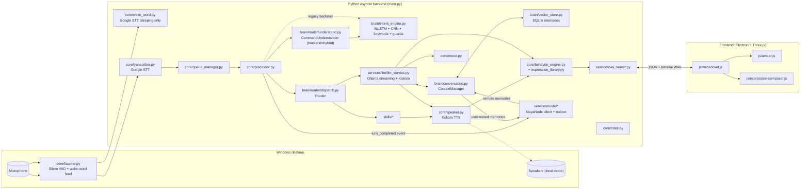
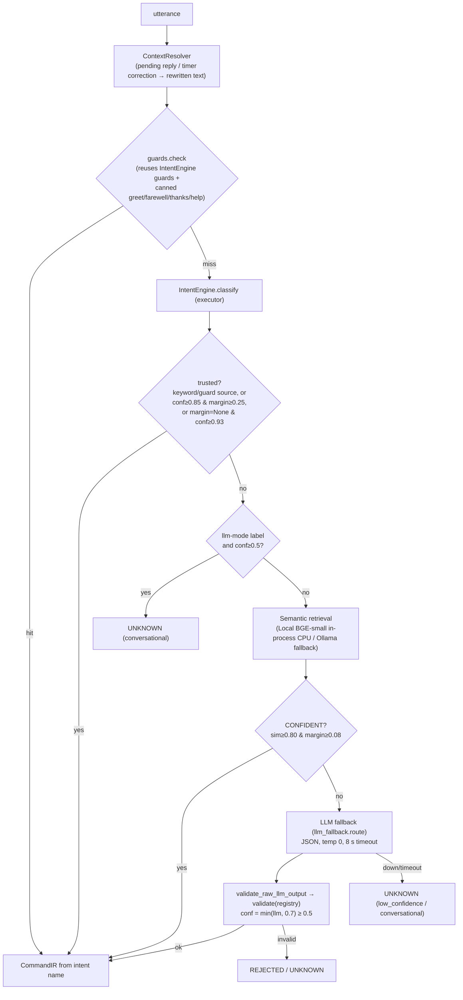

**Source of truth:** This document describes the currently implemented architecture. If it conflicts with the source code, the code wins — verify against source before changing anything.

# MayaVE (VE11) — Technical Architecture

**Basis:** static inspection of the repository snapshot (source, tests, configs, datasets metadata, eval logs). **Nothing was runtime-tested for this revision.** Claims describe code paths; statements about measured behavior cite `logs/` evidence and are marked as snapshots. Binary assets (`.vrm`, `.vrma`, `.vroid`) are Git LFS-managed and their contents are unverified. Datasets under `datasets/training/*.jsonl` and `config/command_domains.json` were inspected through their consumers and reports, not row by row.

Development rules and session context: `docs/CONTRIBUTING.md`. History: `docs/CHANGELOG.md`. MayaVE⇄MayaNode wire contract: `docs/PROTOCOL_CONTRACT.md`.

---

## 1. System overview

MayaVE ("Maya") is a local-first, single-user, Windows-first desktop voice assistant with a transparent, always-on-top 3D VRM avatar. Persona: FRIDAY-like; addresses the user as `config.user_name` (`"senpai"`).

Two cooperating processes:

- **Backend** — Python 3.11+ `asyncio` application (`main.py`, `core/`, `brain/`, `services/`, `skills/`, `config/`). Owns audio capture, wake word/VAD, STT, intent understanding, skill dispatch, LLM orchestration, TTS, mood/context/memory, and the WebSocket server.
- **Frontend** — Electron + Vite + Three.js VRM avatar (`frontend/`). Pure WebSocket client; no access to backend state.

They communicate over a single WebSocket (`ws://localhost:8765`). There is no REST API. An optional third party, **MayaNode** (separate repository), is reached over HTTP by `services/node/`.

### Principles demonstrably present in the code

| Principle | Where |
|---|---|
| Local-first inference (Ollama, Kokoro, local SQLite); only STT, Open-Meteo and `ip-api.com` leave the machine | `llm_service.py`, `core/speaker.py`, `core/transcriber.py`, `skills/web/weather.py` |
| Configuration-driven taxonomy: intents/keywords/response modes/guard vocabularies come from `datasets/intents.json`; commands/entities/seeds from `config/command_domains.json` | `brain/intent_engine.py`, `brain/router/registry.py` |
| Deterministic boundaries before probabilistic ones: guards → keyword rules → ML → semantic retrieval → LLM, each gated by confidence | `brain/router/understand.py` |
| Fail-closed execution: only an *executable* `CommandIR` can reach a skill; LLM output is never trusted until validated against the registry | `brain/router/ir.py`, `validate.py`, `dispatch.py`, `skills/base.py` |
| Skills own their own parsing and confirmations; the router only selects and extracts | `skills/*`, `brain/router/entities.py` |
| Best-effort side systems never break the voice loop (Node sync, semantic memory, diagnostics, expression library) | `services/node/*`, `brain/conversation.py` |
| Single serialization point for turns; single FSM | `core/queue_manager.py`, `core/state.py` |

---

## 2. High-level architecture


```mermaid
flowchart LR
    subgraph OS["Windows desktop"]
        Mic[("Microphone")] --> Listener
        Speakers[("Speakers (local mode)")]
    end

    subgraph Backend["Python asyncio backend (main.py)"]
        Listener["core/listener.py\nSilero VAD + wake-word feed"]
        Wake["core/wake_word.py\nGoogle STT, sleeping only"]
        Trans["core/transcriber.py\nGoogle STT"]
        Queue["core/queue_manager.py"]
        Proc["core/processor.py"]
        Understand["brain/router/understand.py\nCommandUnderstander (backend=hybrid)"]
        Legacy["brain/intent_engine.py\nBiLSTM + CNN + keywords + guards"]
        Router["brain/router/dispatch.py\nRouter"]
        Skills["skills/*"]
        LLM["services/llm/llm_service.py\nOllama streaming + Kokoro"]
        Ctx["brain/conversation.py\nContextManager"]
        VS["brain/vector_store.py\nSQLite memories"]
        Mood["core/mood.py"]
        Beh["core/behavior_engine.py\n+ expression_library.py"]
        Spk["core/speaker.py\nKokoro TTS"]
        WS["services/ws_server.py"]
        FSM["core/state.py"]
        Node["services/node/*\nMayaNode client + outbox"]
    end

    subgraph Front["Frontend (Electron + Three.js)"]
        WSC["js/websocket.js"] --> Avatar["js/avatar.js"]
        WSC --> Expr["js/expression-composer.js"]
    end

    Mic --> Listener --> Trans --> Queue --> Proc
    Listener --> Wake
    Proc --> Understand --> Legacy
    Proc -. legacy backend .-> Legacy
    Proc --> Router --> Skills
    Router --> LLM
    LLM <--> Ctx <--> VS
    LLM --> Mood
    Skills --> Spk
    LLM --> Spk
    Spk --> Beh --> WS
    LLM --> Beh
    WS <-->|JSON + base64 WAV| WSC
    Proc -->|turn_completed event| Node
    Ctx -->|user-stated memories| Node
    Node -->|remote memories| Ctx
    Spk -.-> Speakers
```

---

## 3. Runtime flow

### 3.1 Startup (`main.py::main`)
1. `HF_HUB_OFFLINE=1` is set before any import that can load kokoro/huggingface_hub; `logs/` is created; rotating log (5 MB × 3).
2. Register the state observer (LISTENING watchdog), start `ws_server.serve()` and `node_sync_manager.run()` as background tasks (the latter returns immediately when `config.node.enabled` is `False`).
3. Construct `Speaker()`, `Transcriber()`, `Processor(speaker)` — which loads/auto-trains `IntentEngine`, builds `Router(speaker)` (also injects the speaker into `timer.py`), and initializes `CommandUnderstander` (`config.router.backend == "hybrid"` by default).
4. Register `state.register_stop_callback(_hard_stop_audio)`, then warm up in parallel: Ollama chat (1 token, `keep_alive`), local BGE embeddings (Opt 13), and eager Kokoro CUDA forward pass via `ensure_kokoro_warmed()` (Opt 14, shared lazy pipeline Opt 3, auto-detecting CUDA via `device="auto"`).
5. FSM → IDLE, broadcast `wave`, speak the greeting (before the Listener exists).
6. `asyncio.TaskGroup`: `Listener.start()` + `queue_manager.run()` (**Python ≥ 3.11**).

### 3.2 One voice turn

```
mic callback thread → Listener._process_frame
  ├─ WakeWordDetector.feed_frame (every frame; acts only while SLEEPING)
  └─ Silero VAD → utterance → main.on_speech
on_speech: [LISTENING + WS "listening" if not busy] → Transcriber (Google STT, executor)
  → empty: back to IDLE
  → barge-in check (was_speaking snapshot + contains_wake_word) / sleep command
  → queue_manager.put (maxsize 10; full → dropped, LISTENING reset)
QueueManager → Processor.handle
  PROCESSING + WS "processing" + transcript
  → add_user (rolling window)
  → _classify:  hybrid (default) → CommandUnderstander.understand → to_legacy_intent(ir)   (intent["_ir"])
                legacy           → IntentEngine.classify (executor)
  → context_manager.observe_user_turn (whole-utterance target blanked)
  → Router.dispatch
        1. pending confirmations: power → reminder duration → note delete
        2. IR safety net (see §4.4)
        3. handler: skill → "[tag] text"   |   LLM → streams and speaks itself (ALREADY_SPOKEN)
  → Speaker.speak (skill replies) → turn_lifecycle.rest() → record_event("mayave.turn_completed")
```

State sequence: `listening → processing → speaking → idle`. Skill/LLM paths finish through `core/turn_lifecycle.rest()`, which re-checks `state.is_sleeping()` so a concurrent "go to sleep" wins.

---

## 4. Intent understanding and routing

Two classification backends exist, selected by `config.router.backend` (`"hybrid"` default, `"legacy"` fallback). In the active hybrid mode, `CommandUnderstander` generates a `CommandIR`, which is bridged to `Router.dispatch` via `to_legacy_intent(ir)`. Both paths end in the dict shape consumed by `Router.dispatch`.

### 4.1 Legacy classifier — `brain/intent_engine.py` (always present)

`IntentEngine.classify(text)` → `{intent, target, confidence, raw, model, response_mode, second_intent, second_confidence, margin}`.

Order of decision (first match wins):

1. **Guards** (deterministic, confidence 1.0): dismissal exact-phrase match (after filler/address trimming); presence/arrival regex → `smalltalk`; action-word regex (nod/giggl/sigh/shrug/wink/wynk) unless phrased as a question → `perform_action`; farewell canned guard with context-sensitive boundary check for "see you" / "see ya" to avoid misrouting conversational utterances (e.g., "happy to see you").
2. **Short-input keyword rule:** ≤ 3 tokens and not a comparison → a keyword match wins outright (`keyword_short_input`).
3. **Ensemble:** PyTorch BiLSTM+attention and TensorFlow 1-D CNN, probabilities averaged. Confidence ≥ `_CONF_THRESH` (0.65) → accepted. Top-2 class and `margin` come from this same averaged distribution.
4. **Keyword fallback** below 0.65 (`keyword_fallback`), then a chance-relative floor (`1/N × 8`, clamped 0.20–0.45) → `low_confidence_trusted`, else `unknown` (`low_confidence_fallback`).

`margin`/`second_*` are `None` for guard and keyword decisions (no meaningful runner-up). Keywords are phrase-level, matched with `\b…\b` plus inflection suffix, in the order given by `keyword_rules_order` in `datasets/intents.json`. 41 intents are declared; `response_mode` (`skill`|`llm`) is read from that file, never hardcoded.

`_extract_target` strips command phrases for `open_target`, `search_web`, `set_timer`; it returns `""` when a trigger matched with nothing after it, so skills ask for clarification.

### 4.2 Hybrid pipeline — `brain/router/understand.py` (active default)

`CommandUnderstander.understand(text) → CommandIR` is the active routing path in VE11. It never executes anything and never imports a skill.


```mermaid
flowchart TD
    T["utterance"] --> C["ContextResolver\n(pending reply / timer correction → rewritten text)"]
    C --> G{"guards.check\n(reuses IntentEngine guards +\ncanned greet/farewell/thanks/help)"}
    G -- hit --> IR1["CommandIR from intent name"]
    G -- miss --> CL["IntentEngine.classify (executor)"]
    CL --> TR{"trusted?\nkeyword/guard source, or\nconf≥0.85 & margin≥0.25,\nor margin=None & conf≥0.93"}
    TR -- yes --> IR1
    TR -- no --> CV{"llm-mode label\nand conf≥0.5?"}
    CV -- yes --> UNK1["UNKNOWN (conversational)"]
    CV -- no --> SEM["Semantic retrieval\n(Local BGE-small in-process CPU / Ollama fallback)"]
    SEM --> SC{"CONFIDENT?\nsim≥0.80 & margin≥0.08"}
    SC -- yes --> IR1
    SC -- no --> LF["LLM fallback (llm_fallback.route)\nJSON, temp 0, 8 s timeout"]
    LF --> V["validate_raw_llm_output → validate(registry)\nconf = min(llm, 0.7) ≥ 0.5"]
    V -- ok --> IR1
    V -- invalid --> REJ["REJECTED / UNKNOWN"]
    LF -- down/timeout --> UNK2["UNKNOWN (low_confidence / conversational)"]
```

Notes:

- A low-confidence **command** is never forced into an intent: it ends `UNKNOWN` with `legacy_intent="unknown"`. A low-confidence **conversational** label goes to the chat LLM.
- Thresholds in `understand.py` (`MIN_CONF=0.85`, `MIN_MARGIN=0.25`, `MIN_CONF_NO_MARGIN=0.93`, `LLM_MIN_CONF=0.5`) and `config.router` (`min_similarity=0.80`, `min_margin=0.08`, `low_similarity_floor=0.55`) are calibrated against the test suite and eval cases.
- `understand()` cannot raise: any stage failure degrades to `UNKNOWN` (`reason="internal_error"`).
- Per-run counters (`stats`) feed `eval_ir`.
- Semantic similarity is command-level: every seed of a `domain.operation` is a vector; scores collapse to the best per command; margin = best − second-best *distinct* command (`schemas.aggregate_by_command`).

### 4.3 `CommandIR` (`brain/router/ir.py`)

| Status | Meaning | Reaches a skill? |
|---|---|---|
| `READY` | command identified, no missing required entities | yes (if `executable`) |
| `NEEDS_CLARIFICATION` | required entity missing; `prompt` holds the question | no → `Router._clarify` |
| `UNKNOWN` | conversational, out of scope, or too uncertain | no → LLM |
| `REJECTED` | LLM output failed validation | no → LLM |

`executable = READY ∧ no missing entities ∧ legacy_intent`. `to_legacy_intent(ir)` bridges to the dispatch contract:
- `READY` preserves the target skill's `legacy_intent` name and sets `response_mode="skill"`.
- `UNKNOWN` with `reason="conversational"` preserves the classified conversational intent name (e.g. `smalltalk`, `joke`) with `response_mode="llm"`.
- All other `UNKNOWN` and `REJECTED` cases collapse strictly to `intent="unknown"` and `response_mode="llm"` to prevent accidental execution of unvalidated skills.
- Guarded/canned skills outside the registry (greet, help, farewell, thanks, perform_action, mute) become `READY` with `domain="legacy"`.

### 4.4 Dispatch safety net (`brain/router/dispatch.py`)

`Router._routes` is the single intent→handler map. With an IR attached: `NEEDS_CLARIFICATION` → `_clarify`; a non-executable IR is forced to `llm_query`; an executable IR with `requires_confirmation` whose handler does not self-confirm (`power.py`, `notepad.py`) **fails closed** with an apology. Skills receive `ir.effective_text` (context-rewritten); the LLM and pending-confirmation resolvers receive the user's original words.

### 4.5 `HybridIntentEngine` (`brain/router/hybrid_engine.py`) — present, **not wired**

A legacy-shaped wrapper (`classify` sync + `aclassify` async, shadow-mode comparison, `hybrid_domains` allow-list). No caller exists in `main.py`/`processor.py`; it is exercised by `brain/test_hybrid_router.py`. `config.router.shadow_mode` and `hybrid_domains` are consumed only by this class, not by `CommandUnderstander`.

### 4.6 Deterministic vs probabilistic components

| Component | Nature |
|---|---|
| Guards, keyword rules, regex entity extractors, `validate`, `ContextResolver`, confirmations | deterministic |
| BiLSTM+CNN ensemble, embedding similarity | probabilistic (seeded training; fixed after training) |
| LLM fallback | probabilistic; output is data to be validated, never an instruction |

### 4.7 Context resolver (`brain/router/context.py`)

Router-only context (not `ContextManager`). Rewrites an utterance into a standalone command: a pending clarification (`duration` only, 30 s TTL, consumed by the next turn) resolves only when the reply is *nothing but* a duration; a timer correction (600 s TTL, needs a marker like "actually"/"make it") resolves only to a duration or bare number. Corrections produce a new `set a timer for N …` command (no `timer.update` exists).

---

## 5. Entity system

- **Declaration:** per operation in `config/command_domains.json` (`entities: {name: {type, required, prompt}}`, `target_mode: "raw" | "entity:<name>"`).
- **Extraction:** `brain/router/entities.py::EXTRACTORS`, keyed by entity name: `duration` (int seconds; mirrors `timer._parse_duration` — first match per unit, number words one…sixty; zero or "an hour" ⇒ none), `message` (mirrors `timer._extract_reminder`), `location` (mirrors `weather._extract_location`), `target`/`query` (the classifier's extracted target). Entities with no extractor (`content`) stay optional unless the LLM supplies them.
- **Precedence:** deterministic value > LLM string. `extract_entities` returns `(entities, missing_required)`.
- **Validation:** `validate.validate` — entity keys must be declared for the operation, values must be strings ≤ 500 chars, required entities present (skipped with `enforce_required=False`, used for identity-only checks on semantic/LLM picks because entities are extracted afterward).
- **Downstream:** `CommandIR.entities`/`target`; skills still re-parse `effective_text` themselves (the extractors exist to decide READY vs clarify and to evaluate accuracy). `adapter.to_legacy_intent` (HybridIntentEngine path) applies `target_mode`.
- **LLM role:** may propose entities under schema-defined keys only (the prompt lists allowed keys per operation). Invented keys are rejected by validation (see §15 findings).
- **Failure:** missing required → `NEEDS_CLARIFICATION`; target re-derived for the *selected* spec's legacy intent when semantic/LLM disagree with the classifier.

---

## 6. Skills (`skills/`)

Convention: `async execute(intent, text) -> str` returning tagged text (`"[happy] …"`). `perform_action` also sets `intent["action"]`; the Processor dispatches it over the animation channel in sync with audio start. `skills/base.py` defines `SkillResult`, `SkillRegistry` (native registrations + a live reference to `Router._routes`) and `LegacySkillAdapter`; it is not on the live dispatch path (`Router.dispatch` does not consult it).

| Skill | Intents | Notes |
|---|---|---|
| `system/open_target.py` | `open_target` | known sites → known apps → URL → app passthrough → bare-label site guess |
| `web/google_search.py` | `search_web` | opens a results page only |
| `web/weather.py` | `get_weather` | Open-Meteo + geocoding, `ip-api.com` fallback |
| `system/power.py` | `shutdown`, `restart` | one-shot spoken confirmation (30 s), `shutdown /s|/r /t 10` |
| `system/lock_screen.py` | `lock_screen` | immediate, no confirmation |
| `system/system_info.py` | `system_info`, `screenshot` | psutil/pyautogui in executor; may report mood events |
| `system/clipboard.py` | `clipboard_*` | `pyperclip` optional |
| `media/play_music.py` | play/pause/next/prev/volume/mute | `keyboard` media keys; `mute` has no registry operation |
| `utilities/datetime_skill.py` | `get_time`, `get_date` | |
| `utilities/timer.py` | `set_timer`, `cancel_timer`, `timer_status` | alerts queued via `queue_manager.put_job`, spoken under `run_interruptible` |
| `utilities/notepad.py` | `note_write/view/delete` | `~/Maya/Notes`; delete is confirmation-gated |
| `system/perform_action.py` | `perform_action` | closed vocabulary nod/giggle/sigh/shrug/wink |
| built-ins in `dispatch.py` | `greet`, `farewell`, `thanks`, `help`, `clarify` | |
| LLM-routed | `confirm`, `dismissal`, `smalltalk`, `identity`, `joke`, `motivate`, `opinion`, `followup`, `general_query`, `unknown` | |

---

## 7. LLM architecture

**The LLM does:** (a) generate conversational replies (`llm_service.query`, streamed, persona + mood + `ContextPackage` in the system prompt, expression/attitude/intensity/action tags); (b) act as the *last-resort routing fallback* in hybrid mode (`llm_fallback.route`: non-streaming, JSON, temperature 0, 8 s timeout, `keep_alive`); (c) optionally assist offline dataset auditing/generation (`brain/dataset_tools.py`, model `llama3.1`).

**The LLM does NOT:** run skills, make execution decisions on its own output, extract entities that deterministic extractors can find, decide confirmations, or write memory (memory writes are regex-gated, §9). It has no tool-calling layer.

Streaming pipeline (`llm_service.py`): `build_context_package` → Ollama `/api/chat` stream → phrase-boundary splitter (`_next_boundary`, vocative-aware, decimals-safe) → `_parse_expression` → `synth_q` → Kokoro (`_run_kokoro`, daemon thread, 15 s timeout) → `play_q` → per phrase: actions → behavior → `speaking` → audio → browser `audio_done` → baseline behavior. Optional "thinking filler" only for `general_query`/`unknown` with ≥ 3 words from non-low-confidence sources. A barge-in cancels the whole pipeline; history records only phrases whose playback began (or a short interruption marker if none).

**Expression parsing & action validation (`_parse_expression`):** Valid physical actions (`nod`, `giggle`, `sigh`, `shrug`, `wink`) are extracted strictly against `_ACTION_VOCABULARY`. Non-action asterisks (such as markdown emphasis `*really*` or `**excited**`) are preserved verbatim as spoken prose rather than destructively removed.

**GPU-accelerated Kokoro TTS:** PyTorch CUDA build accelerates Kokoro synthesis on GPU via `config.tts.device = "auto"`, falling back to CPU when CUDA is unavailable. On the tested reference configuration (NVIDIA GeForce RTX 3050 Laptop GPU, 4GB VRAM), Kokoro CUDA synthesis runs concurrently with Ollama `llama3.2` without CUDA out-of-memory errors, model eviction, or process contention under the tested workload.

---

## 8. State machine and barge-in (`core/state.py`)

`MayaState`: `SLEEPING, IDLE, LISTENING, PROCESSING, SPEAKING, INTERRUPTED`. One `StateManager` singleton; `run_interruptible()` registers **one** `_current_task`. `interrupt()` runs when SPEAKING or PROCESSING with a live speech task: stop callback (`sd.stop()` + `stop_audio`) → cancel task → LISTENING. Barge-in requires the wake word in the utterance; other speech over a reply is queued normally. Observers (`add_observer`) drive the 15 s LISTENING watchdog in `main.py`. Sleep wins races via `turn_lifecycle.rest()`, `Speaker.speak()`'s finally, and `Processor.handle()`'s early bail-out. Residual gap: a skill in its blocking dispatch phase is not interruptible.

---

## 9. Memory

| Layer | Implementation | Persistence |
|---|---|---|
| Recent window | `brain/memory.py` (`max_entries=50`, evict callback) | process only |
| Conversation state & open loops | `ContextManager` (topic/phase/goal/constraints/entities, open loops) | process only |
| Semantic long-term | `SQLiteVectorStore` (`~/Maya/Memory/semantic_memory.sqlite3`, NumPy brute-force cosine), embeddings via `OllamaEmbedder` (`nomic-embed-text`) | SQLite |
| Command vectors (router) | `CommandVectorStore` — **separate** SQLite file (`~/Maya/Router/command_vectors.sqlite3`) + `.fingerprint.json` sidecar | SQLite |
| Notes | `~/Maya/Notes/*.txt` | files |
| MayaNode outbox / cursor / device id | `~/Maya/Node/{outbox,sync_state}.json`, `device_id.txt` | JSON |

Write policy: only explicit cue phrases ("remember that", "my favorite", "I prefer", …) from non-noise intents become `user_stated` memories, deduped by similarity (0.92) and updated in place. Auto-compaction of evicted turns writes a keyword gist (`conversation_summary`, never synced). Retrieval is skipped for short followup/confirm/dismissal turns and for memories newer than 120 s. Any embedding/store failure degrades to recent-context only.

---

## 10. Mood and behavior

`core/mood.py` (singleton `mood_manager`): event-driven persistent mood (`angry`/`sad` only) plus transient teasing reaction; user-text regexes, skill/system `report_event`, and reply tags (confirmation only). Decays by distraction, time (3 %/min) and a 20-minute forget threshold. `core/behavior_engine.py::compose` turns `(expression, attitude, intensity, mood)` into a packet `{primary, secondary, intensity, attitude, gaze, actions, recipe}`; recipes come from `core/expression_library.py` (`frontend/assets/expressions.json`: cache-first, deterministic default composition, atomic single-writer persistence, refuses to overwrite an unreadable file). Closed vocabularies — emotion `happy|sad|angry|surprised|relaxed|neutral|excited`; attitude `sincere|playful|teasing|mock`; intensity `low|medium|high`; actions `nod|giggle|sigh|shrug|wink`; gaze `direct|soft|away` — are duplicated across files by design and are not expanded to reach stored recipes (edit points: `llm_service.py`, `speaker.py`, `behavior_engine.py`, `expression_library.py`; actions additionally `perform_action.py`, `intents.json` action words, `websocket.js`, `_VRMA_ASSETS`).

---

## 11. Frontend (`frontend/`)

Electron (transparent, frameless, always-on-top, click-through window) + Vite dev server + Three.js + `@pixiv/three-vrm(-animation)`. `main.js` owns scene/renderer and the single frame loop (render, `vrm.update`, VRMA mixers, gaze). `websocket.js` is the only backend link (reconnect 2 s; sends only `audio_done`). `handleState` is the single source of avatar sleep/wake; `ws.onclose` also sleeps the avatar.

Arbitration: `expression-controller.js` (`BASE<EMOTION<ACTION<LIPSYNC<BLINK` per key); `animation-controller.js` (bone ownership `BASE<FIDGET<ACTION`, 350 ms handoff); `life-motion-controller.js` (breathing/posture/shoulders/hips, BASE tier); `gaze-controller.js` (attention state machine fed by `observeScreenActivity`, currently only via `window.maya` — no screen capture exists). `expression-composer.js` writes raw `Fcl_*` morph targets when the recipe resolves on the loaded model, else falls back to the six-key legacy path. Idle fidgets: 7–18 s scheduler gated by awake/idle/not speaking/5-minute calm period, per-fidget cooldowns, forced `waving` after 30 minutes idle. The Expression Lab (`expression-lab.html` + `js/expression-lab.js`) is a standalone calibration page (localStorage drafts, import/export `expressions.json`), not part of the runtime. Only dev-server mode is evidenced; `vite build` does not copy `assets/`.

---

## 12. WebSocket protocol (`services/ws_server.py` ⇄ `frontend/js/websocket.js`)

Server → client: `audio` (base64 WAV), `stop_audio`, `state` (`listening|processing|speaking|idle|sleeping`; last state replayed on connect), `behavior` (sent before the phrase audio), `transcript` (ignored by UI), `animation` (`wave|nod|giggle|sigh|shrug|wink`), `expression` (legacy, unused). Client → server: `audio_done` (gates the next phrase), `interrupt` (handler exists; no frontend sender). Origins are restricted by `config.ws_allowed_origins`. `wait_for_audio_done` returns immediately with no client, otherwise 30 s timeout then continues.

---

## 13. MayaNode integration (`services/node/`, client side only)

MayaNode is a **separate repository**; this repo implements only the client. Disabled by default (`config.node.enabled=False`).

| Module | Responsibility |
|---|---|
| `discovery.py` | probe `base_url` then `discovery_candidates` with `GET /status` |
| `client.py` | guarded `GET /health`, `POST /heartbeat`, `POST /sync`; `Authorization: Bearer` hook (not enforced server-side); validates outgoing events and the response (`SyncResult.from_response`) |
| `protocol.py` | MayaVE's own implementation of the contract in `docs/PROTOCOL_CONTRACT.md`: `protocol_version=1`, event envelope validation, registry (`protocol.ping`, `mayave.turn_completed{intent}`), request builder, change-ordering check |
| `identity.py` | stable `device_id` (`mayave-<uuid>`) persisted at `~/Maya/Node/device_id.txt` |
| `sync_state.py` | monotonic cursor persisted atomically |
| `outbox.py` | durable pending queue: events keyed by `event_uid` (idempotent), memory keyed by `key` (last-write-wins by `updated_at`); single background writer thread; removal only of items the server settled |
| `events.py`, `memory_producer.py` | the only application-facing producers (`record_event`, `record_memory`); never block, never need Node |
| `sync_manager.py` | loop: discover → heartbeat → `/sync` (pushes ≤ 200 events / ≤ 200 memory keys, advances cursor, reconciles outbox, then applies incoming memory) → sleep `sync_interval_s`; exponential backoff to `max_backoff_s`; never raises |

Data actually flowing: `Processor` records `mayave.turn_completed` with **only** the intent id; `ContextManager._persist_memory` mirrors `user_stated` fact/preference memories as `semantic_memory:<row_id>` `{content, mem_type, topic, importance}` (never embeddings, never compaction summaries). Incoming: `apply_remote_memory_changes` accepts only `semantic_memory:*` keys, re-embeds locally, dedups against the local store, and inserts with `source="mayanode_sync"`. Incoming `changes["events"]` are deliberately not applied. `has_more` is logged but not looped (one page per interval). Server-side behavior (persistence, `seq` assignment, conflict resolution) is defined by the contract and is out of scope here.

---

## 14. Data and training pipeline

| Artifact | Location | Role |
|---|---|---|
| Intent taxonomy | `datasets/intents.json` | ids, categories, descriptions, `min_examples`, keywords, `response_mode`, dismissal phrases, action words, keyword order |
| Training splits | `datasets/training/{train,validation,test}_data.jsonl` | `{text, intent, source, verified, variant}`; strict intent-id validation |
| Staging | `datasets/training/candidates.jsonl` (+ `candidates_rejected.jsonl`, `audit_report.json`) | untrusted candidates |
| Router eval cases | `datasets/router_eval/cases.jsonl` (60 cases at time of inspection) | IR-level evaluation |
| Command registry | `config/command_domains.json` | 25 `domain.operation` entries with entities, `target_mode`, `requires_confirmation`, semantic `seeds` |
| Models | `datasets/intent_model/` (gitignored) | `pytorch_intent.pt`, `tf_intent.keras`, `vocab.json`, `labels.json`, `training_hash.txt` |

Runtime model production: `IntentEngine._load_or_train` loads saved artifacts when the fingerprint (intents config + seed + train rows) matches `training_hash.txt`, otherwise retrains both models from scratch (`MAYA_SEED`, default 1337; seeded torch/numpy/python/DataLoader/TF) and rewrites the hash. `python -m brain.train_intent [--eval-only]` is the explicit retrain + evaluation report.

Tooling (`brain/dataset_tools.py`): LLM candidate generation (Ollama `llama3.1`) → automatic deterministic **audit** (malformed, duplicate, contradiction, generic, keyword/vocabulary confusability, restored-intent checks, boundary phrases, templates, diversity; optional capped LLM judgment) → human `verified` marking → `candidates promote` (80/10/10 per intent, cross-split dedup) ; failure-log review/promotion (`logs/intent_failures.jsonl`, never auto-trained); `migrate-legacy-intents` (retired ids → `note_write`, `note_view`, `open_target`, `set_timer`). `datasets/stage_data.py` stages hand-written rows/cases with leak/near-duplicate checks (dry run by default); `datasets/review_candidates.py` writes a read-only review report.

Router corpus: `python -m brain.router.eval_router --seed` embeds every seed into the command vector store; staleness is detected by a hash of `command_domains.json` and only warned about (never auto-reseeded).

---

## 15. Testing and evaluation

| Layer | Files | Scope |
|---|---|---|
| Unit/contract tests (170 tests passing) | `brain/test_hybrid_router.py`, `brain/router/test_ir.py`, `brain/router/test_router_boundaries.py`, `brain/router/test_intent_margin.py`, `brain/test_failure_logging.py`, `services/llm/test_conversational_response.py`, `brain/conftest.py` | registry/taxonomy drift, confidence policy, validation, adapter, vector store, LLM failure modes, conversational expression parsing, `CommandUnderstander` stages, context rewrite, entity extraction, `SkillResult`/adapter, confirmation propagation, classifier margin (`IntentEngine.__new__` + fake model) |
| Retrieval evaluation | `brain/router/eval_router.py` | per-split accuracy and (similarity, margin) threshold sweeps |
| IR evaluation | `brain/router/eval_ir.py`, `datasets/router_eval/cases.jsonl` | false-execution rate (primary), wrong command/entity, OOS precision/recall, clarification recall, LLM fallback rate, latency, `per_case`, `model_digest` |
| Cross-seed analysis | `brain/router/failure_matrix.py`, `diag.py` | failure frequency across seeds (60 benchmark cases), classifier misses |
| Classifier evaluation | `brain/train_intent.py` | per-intent P/R/F1 and confusions on validation/test |

`tests/` is gitignored; tests live beside the code. Test execution: `pytest brain services/llm -q` (**170 passed, 44 warnings**; warnings are external TensorFlow/Keras and conversational test logger messages). All Python SyntaxWarnings (literal identity checks) have been eliminated.

**Failure Matrix Benchmark** (`brain/router/failure_matrix.py` across 60 evaluation cases with semantic + LLM wired):
- `seed1`: 0/60 failures
- `seed2`: 1/60 failure (known ambiguous clarification variance on `"timer for a quarter of an hour"`)
- `seed3`: 0/60 failures
- `seed1_repeat`: 0/60 failures
- Cross-seed consistency: 59/60 (98.3%) across tested seeds.

*Note: This failure matrix represents a targeted 60-case regression evaluation suite across deterministic seeds, not a generalized accuracy metric.*

Run (environment-dependent; needs the project dependencies and, for some tests, Ollama/trained models):
- Test suite: `python -m pytest brain services/llm -q`
- Seed command vector store: `python -m brain.router.eval_router --seed`
- Single IR evaluation run: `python -m brain.router.eval_ir --semantic --llm`
- Generate multi-seed benchmark runs (PowerShell):
  ```powershell
  foreach ($run in @(@(1,"seed1"), @(2,"seed2"), @(3,"seed3"), @(1,"seed1_repeat"))) {
    $env:MAYA_SEED = $run[0]
    python -m brain.router.eval_ir --semantic --llm 2>$null | Out-File -Encoding utf8 "logs/runs60/$($run[1]).json"
  }
  ```
- Failure matrix summary: `python -m brain.router.failure_matrix --dir logs/runs60`

---

## 16. Configuration

| Source | Authority over |
|---|---|
| `config/settings.py` (`config` singleton) | names, wake word, audio/STT/TTS/LLM/context/router/node settings, WS host/port/origins |
| `datasets/intents.json` | intent taxonomy, keywords, response modes, guard vocabularies |
| `config/command_domains.json` | routable commands, entities, confirmation flags, semantic seeds |
| `frontend/assets/expressions.json` | expression recipes |
| Env vars | `MAYA_SEED`, `MAYA_EMBEDDING_DEVICE`, `HF_HUB_OFFLINE`, `TF_CPP_MIN_LOG_LEVEL`, `VITE_DEV_SERVER_URL`, `OneDrive` |
| `getattr`-only (not dataclass fields) | `config.context.embedding_device`, `config.notes_dir`, `config.llm.keep_alive` (default `60m`) |

Key defaults: `RouterConfig.backend="hybrid"` (active default), `hybrid_domains=[]`, `shadow_mode=False`; `NodeConfig.enabled=False` (client-side only, disabled by default), `sync_interval_s=60`, caps 200/200; `TTSConfig.output="avatar"`, `device="auto"` (CUDA auto-detect with CPU fallback); `LLMConfig.model="llama3.2"`, `max_tokens=150`. Name/wake-word-derived regexes are compiled once at import. No `pyproject.toml`, `.env.example` or `CLAUDE.md` exists in the inspected snapshot; dependencies are in `config/requirements.txt` (+ `frontend/package.json`).

---

## 17. Failure handling

| Failure | Behavior |
|---|---|
| Ollama down (chat) | spoken apology, not stored in history |
| Ollama/embedding down (router) | semantic tier inert → LLM fallback → `UNKNOWN`; embeddings `None` → recent-context only |
| LLM fallback timeout/invalid JSON | `None` → `UNKNOWN`; invalid registry match → `REJECTED` (routes like unknown) |
| Stage exception in `understand` | `UNKNOWN` (`internal_error`); `_classify` failure → legacy classifier |
| Skill exception | spoken apology, `_no_history` |
| Kokoro hang | 15 s timeout, pipeline rebuild (own pipeline only) |
| Missing frontend / no `audio_done` | no-client returns immediately; 30 s timeout then continue |
| MayaNode down/malformed | every call returns a failure value; backoff + rediscovery; outbox retains items |
| Corrupt `expressions.json`, outbox, sync state | not overwritten / start fresh respectively |
| Full command queue | command dropped, FSM reset to IDLE |
| Stuck LISTENING | 15 s watchdog → IDLE |

---

## 18. Repository structure

```
MayaVE/
├── main.py                   runtime entry point
├── diag.py                   router eval diagnostics (dev tool)
├── config/                   settings.py, command_domains.json, requirements.txt
├── core/                     state, listener, wake_word, transcriber, speaker, queue_manager,
│                             processor, turn_lifecycle, mood, behavior_engine, expression_library, confirmation
├── brain/
│   ├── intent_engine.py      legacy ML classifier + guards + keyword rules
│   ├── router/               dispatch, understand (CommandUnderstander), ir, context, entities, validate,
│   │                         registry, schemas, confidence, semantic_router, command_vector_store,
│   │                         llm_fallback, guards, normalize, adapter, hybrid_engine, eval_* tools, tests
│   ├── conversation.py, memory.py, embeddings.py, vector_store.py
│   ├── dataset_tools.py, train_intent.py
│   └── test_hybrid_router.py, conftest.py
├── services/
│   ├── llm/                  llm_service.py, ollama_lifecycle.py
│   ├── ws_server.py
│   └── node/                 MayaNode client, protocol, outbox, producers, sync manager
├── skills/                   base.py, system/, web/, media/, utilities/
├── datasets/                 intents.json, training/, router_eval/, intent_model/ (generated), tooling scripts
├── frontend/                 electron/, js/, assets/ (VRM/VRMA via LFS), index.html, expression-lab.html
├── docs/                     architecture.md, CHANGELOG.md, CONTRIBUTING.md, PROTOCOL_CONTRACT.md
├── logs/                     runtime logs, eval outputs, failure log (generated)
└── .github/workflows/        changelog-issues.yml (syncs CHANGELOG Issues/Fixes to GitHub Issues)
```

---

## 19. Invariants (do not break)

**Ordering / async** — the command queue serializes ordinary turns (startup/wake/sleep speech and timer alerts are intentional direct or queued-job paths); per-phrase order is actions → behavior → `speaking` → audio → `audio_done` → baseline; callbacks cross into asyncio via thread-safe scheduling; blocking work goes to an executor; `StateManager` tracks one interruptible task and SLEEPING must survive turn completion (use `turn_lifecycle.rest()`); pending confirmations resolve before routing.

**Contracts** — skills return tagged text, the LLM path returns `ALREADY_SPOKEN`; behavior travels separately from body animations; no skill may run from a non-executable IR; `requires_confirmation` is declared in the registry but enforced by the skill; extractors must accept only what the downstream skill can itself parse; closed vocabularies stay in sync; `ws_server` replays last state; frontend output mode stays `avatar`.

**Memory / mood** — `Processor` records the user turn before context construction; mood sees user text before generation and the completed tag set after; MayaNode producers must never block or require Node.

**Frontend** — bone writers respect `animationController`; recipe morphs bypass `expressionController`; vowel visemes are reserved for lip-sync; reconnect must not duplicate persistent loops.

---

## 20. Implementation status

| Area | Status |
|---|---|
| Voice loop, skills, LLM streaming, TTS, avatar, mood/behavior, semantic memory | implemented |
| Legacy classifier (guards + keywords + ensemble) | implemented (available as fallback) |
| Hybrid `CommandUnderstander` + IR + dispatch gates | implemented (**active default**, `backend="hybrid"`) |
| Local Semantic Embedding Provider (BGE-small CPU) | implemented (**active default**, Opt 13, latency ~25ms) |
| Kokoro TTS GPU acceleration (`device="auto"`) | implemented (CUDA auto-detection, CPU fallback) |
| Kokoro TTS Eager Warmup (Opt 14) | implemented (**active default**, first user TTS ~320ms vs ~5,883ms cold) |
| `HybridIntentEngine` + shadow mode | implemented, **not wired** to runtime |
| `skills/base.py` `SkillRegistry`/`SkillResult` | implemented, not on the live dispatch path |
| MayaNode client (discovery, sync, outbox, events, memory both directions) | implemented, client-side only, off by default (`enabled=False`); server-side not in repo |
| Screen-attention gaze | input API only; no capture |
| Offline STT, packaged build, echo cancellation | not implemented |

---

## 21. Singletons

`config` (settings) · `state` (FSM) · `memory` (recent window) · `context_manager` · `mood_manager` · `behavior_engine` · `queue_manager` · `ws_server` · `node_sync_manager` · `skill_registry` · frontend: `expressionController`, `animationController`, `gazeController`, `lifeMotionController`.