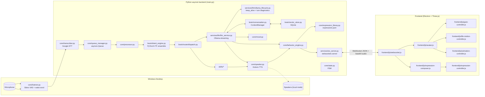

**Source of truth:** This document describes the currently implemented architecture. If it conflicts with the actual source code, the code wins — verify against source before making changes.

# MayaVE (Maya) — Technical Architecture

**Basis:** static inspection of the repository; **no runtime was available**. Claims describe code paths, not runtime observations. Binary assets (`.vrm`, `.vrma`, `.vroid`) are Git LFS-managed, so their runtime contents are unverified here.

Development rules and session context: `docs/CONTRIBUTING.md`.

---

## 1. System Overview

Maya is a local-first, single-user, Windows-first desktop voice assistant with a transparent always-on-top 3D VRM avatar. Persona: FRIDAY-like; addresses the user as `config.user_name` (`"senpai"`). Two cooperating processes:

- **Backend** — Python 3.11+ `asyncio` application (`main.py` + `core/`, `brain/`, `services/`, `skills/`, `config/`). Owns audio capture, wake word/VAD, STT, intent classification, skill dispatch, LLM orchestration, TTS synthesis, mood/context/memory state, and a WebSocket server.
- **Frontend** — Electron/Vite/Three.js VRM avatar (`frontend/`). Pure WebSocket client: no access to backend state; reacts only to messages it receives.

They communicate over one WebSocket (`ws://localhost:8765`, `config.ws_host`/`config.ws_port`). There is no REST API.

**datasets/services:** Ollama chat (`config.llm.model`) + Ollama embeddings (`nomic-embed-text`); Kokoro TTS (local, 24 kHz, CPU by default); Silero VAD (`torch.hub`); Google STT via `SpeechRecognition` (**online**, used for utterances *and* the wake word); intent classifier = PyTorch BiLSTM + TensorFlow CNN ensemble; SQLite semantic memory.


```mermaid
flowchart LR
    subgraph OS["Windows Desktop"]
        Mic[("Microphone")] --> Listener
        Speakers[("Speakers (local mode)")]
    end

    subgraph Backend["Python asyncio backend (main.py)"]
        Listener["core/listener.py\nSilero VAD + wake word"]
        Transcriber["core/transcriber.py\nGoogle STT"]
        Queue["core/queue_manager.py\nasyncio.Queue"]
        Processor["core/processor.py"]
        Intent["brain/intent_engine.py\nPyTorch+TF ensemble"]
        Router["brain/router/dispatch.py"]
        Skills["skills/*"]
        LLM["services/llm/llm_service.py\nOllama streaming"]
        Lifecycle["services/llm/ollama_lifecycle.py\nkeep_alive + turn diagnostics"]
        Context["brain/conversation.py\nContextManager"]
        VectorStore["brain/vector_store.py\nSQLite"]
        Mood["core/mood.py"]
        Behavior["core/behavior_engine.py"]
        ExprLib["core/expression_library.py\nexpressions.json"]
        Speaker["core/speaker.py\nKokoro TTS"]
        WS["services/ws_server.py\nwebsockets server"]
        State["core/state.py\nFSM"]
    end

    subgraph FrontendJS["Frontend (Electron + Three.js)"]
        WSClient["frontend/js/websocket.js"]
        Avatar["frontend/js/avatar.js"]
        ExprComposer["frontend/js/expression-composer.js"]
        Gaze["frontend/js/gaze-controller.js"]
        LifeMotion["frontend/js/life-motion-controller.js"]
        AnimCtrl["frontend/js/animation-controller.js"]
        ExprCtrl["frontend/js/expression-controller.js"]
    end

    Mic --> Listener --> Transcriber --> Queue --> Processor
    Processor --> Intent --> Router
    Router --> Skills
    Router --> LLM
    LLM --> Lifecycle
    LLM <--> Context
    Context <--> VectorStore
    LLM --> Mood
    Skills --> Speaker
    LLM --> Speaker
    Speaker --> Behavior --> WS
    LLM --> Behavior
    Behavior --> ExprLib
    WS <-->|WebSocket JSON + base64 audio| WSClient
    WSClient --> Avatar
    WSClient --> ExprComposer --> ExprCtrl
    Avatar --> AnimCtrl
    Avatar --> Gaze
    Avatar --> LifeMotion
    Speaker -.-> Speakers
```

---

## 2. Startup and Runtime Flow

### 2.1 Startup (`main.py::main`)
1. `os.makedirs(config.log_dir)` before logging setup. `ws_task = asyncio.create_task(ws_server.serve())` (reference kept; failure logged via `_on_ws_done`). Construct `Speaker()`, `Transcriber()`, `Processor(speaker)` → `IntentEngine()` load/auto-train (*synchronous, blocks the loop*), `ConversationManager`, `Router(speaker)` (which also injects the speaker into `timer.py` via `set_timer_speaker`).
2. Start the optional `node_sync_manager.run()` background task alongside the WebSocket task; it returns immediately when Node integration is disabled and isolates connection failures from voice processing. Register `state.register_stop_callback(_hard_stop_audio)`.
3. Warmups (gathered): `_warmup_ollama` (1-token chat with `keep_alive=chat_keep_alive()`), `_warmup_embeddings` (`keep_alive:"30m"`), `llm_service.warmup` (Kokoro, executor), `speaker.warmup` (executor). Then `describe_ollama_models()` diagnostic.
4. `state.set(IDLE)` (Maya starts awake), then startup greeting: `ws_server.broadcast_animation("wave")` + `await speaker.speak(...)` — **before** the Listener exists.
5. `asyncio.TaskGroup`: `Listener.start()` + `queue_manager.run()` (**requires Python ≥3.11**).

### 2.2 Voice command path

```
sounddevice callback thread → Listener._process_frame
   ├─ WakeWordDetector.feed_frame (every frame; active only while SLEEPING)
   └─ Silero VAD → utterance → run_coroutine_threadsafe(main.on_speech)
on_speech → [if not busy: FSM LISTENING + WS "listening"] → Transcriber.transcribe (Google STT, executor)
   → empty: back to IDLE (+WS idle, baseline behavior)
   → barge-in check (was_speaking snapshot + contains_wake_word) / sleep-command check (is_sleep_command)
   → queue_manager.put(text)                 [maxsize=10, drops when full]
QueueManager.run → Processor.handle          [FSM → PROCESSING + WS "processing"]
   → IntentEngine.classify (sync) → context_manager.observe_user_turn
   → Router.dispatch   [pending power confirmation resolved FIRST]
        ├─ skill → returns "[tag] text" → Speaker.speak (Kokoro → WS; FSM SPEAKING → IDLE)
        └─ llm_service.query → returns ALREADY_SPOKEN (speaks itself)
   → WS state idle + mood-baseline behavior
ws_server → frontend/js/websocket.js → avatar.js (audio/lip-sync), expression-composer.js, animations
```

### 2.3 Capture → transcription
1. `core/listener.py` captures mono audio through `sounddevice`; its callback runs off the asyncio loop and submits work with `run_coroutine_threadsafe`.
2. While sleeping, frames feed the Google-STT wake-word path; while awake, Silero VAD segments speech into utterances. VAD also runs during playback; there is no echo cancellation.
3. Completed utterances start independent `main.py::on_speech` tasks. Transcription uses Google STT in an executor and requires internet; commands then follow the state, barge-in, sleep, and queue flow in §2.2.

### 2.4 Wake word
`WakeWordDetector` listens only while the state is SLEEPING and uses Google STT to detect the configured wake phrase. The configured matcher is shared with the barge-in check; a wake callback returns the state to IDLE and speaks a greeting.

### 2.5 Command queue
`core/queue_manager.py` owns a bounded `asyncio.Queue` and one serial worker, preventing ordinary responses from overlapping. A full queue drops new items. Startup/wake/sleep speech and timer alerts use explicit direct paths.

### 2.6 Processing a command (`core/processor.py::Processor.handle`)
1. FSM → PROCESSING; broadcast `state:processing` + user transcript.
2. `ConversationManager.add_user(text)` → `brain/memory.py` rolling window (`max_entries=50`).
3. `IntentEngine.classify(text)` → `{intent, target, confidence, raw, model}`.
4. `context_manager.observe_user_turn(text, intent)` — updates conversation state only; does not write history.
5. `Router.dispatch(intent, text)`.
6. If the response ≠ `ALREADY_SPOKEN`: `_strip_tags(response)` → tag-free text goes to `add_assistant` (skipped when the skill/LLM set `intent["_no_history"]`, i.e. `query()` error strings) and to the transcript broadcast; then `Speaker.speak` with the original tagged text. `on_audio_start` broadcasts `wave` for the `greet` intent, or the animation named by a skill-set `intent["action"]` (from `perform_action`).
7. Always ends with WS `idle` + mood-baseline behavior; exceptions are logged and return to IDLE (no propagation to the queue worker).

State sequence per command: `listening → processing → speaking → idle` (skill/LLM paths set FSM IDLE themselves).

---

## 3. Intent Classification (`brain/intent_engine.py`, `datasets/intents.json`)

`datasets/intents.json` declares intents, response modes, keyword rules, and guard vocabularies. `IntentEngine` validates it and supplies the routing metadata used by `brain/router/dispatch.py`; the training datasets and `brain/dataset_tools.py` / `brain/train_intent.py` support candidate review, retraining, and evaluation.

- **Classification:** PyTorch BiLSTM and TensorFlow CNN predictions are combined, with deterministic guards and keyword rules for short inputs and low-confidence results.
- **Retraining:** a fingerprint of intent configuration and training data triggers retraining when those inputs change.
- **Routing data:** classification returns an intent and target. Missing skill targets remain empty so the skill can ask for clarification; response modes select skill routing or the LLM.

---

## 4. Skill Routing and Skills (`brain/router/dispatch.py`, `skills/`)

`Router.__init__` builds a static `dict[intent → coroutine]`; every labelled intent is routed and unknown/unrouted intents fall back to `llm_query`. Before intent routing, `dispatch` calls `skills.system.power.resolve_pending(raw_text)`: a pending shutdown/restart request is **consumed by the next utterance** (one-shot, 30 s TTL) — confirm phrase → OS action + spoken reply; deny phrase → "cancelled"; anything else → request dropped and the utterance routes normally. It then does the same for a reminder awaiting its duration (`timer.resolve_pending`). Skill exceptions return `"[sad] Sorry senpai, I ran into a problem with that."` (spoken but kept out of history via `_no_history`). The `farewell` intent only replies; it does not sleep.

### 4.1 Hybrid router package
Trace of the existing Processor.handle lifecycle. It sets PROCESSING, then classifies via IntentEngine.classify in an executor, then calls observe_user_turn, then Router.dispatch(intent, text). Router.dispatch already resolves pending confirmations first, already understands intent["_ir"], and already has a clarify route. The narrowest seam is therefore replacing the classify call with one that returns to_legacy_intent(ir). Nothing else moves.

Final runtime flow (hybrid):

STT and on_speech queue the text.
Processor.handle sets PROCESSING and records the raw text via add_user.
_classify calls CommandUnderstander.understand. It resolves context (effective_text), then runs guards, then the classifier's confidence/margin gate, then semantic retrieval, then the LLM fallback, then entity extraction. The result is a CommandIR, and to_legacy_intent turns it into an intent dict carrying _ir.
observe_user_turn receives the raw text and the intent with a blanked whole-utterance target.
Router.dispatch resolves power, reminder and note-delete confirmations first.
NEEDS_CLARIFICATION goes to _clarify.
Non-executable IRs (UNKNOWN/REJECTED) go to llm_query with the raw text.
Executable IRs go to the skill with effective_text.
A declared requires_confirmation fails closed unless the handler self-confirms.
Speaker.speak or the LLM streaming pipeline speaks the reply.
turn_rest runs and the mayave.turn_completed event is recorded.

A failure in understand degrades to an UNKNOWN IR. A failure in _classify or at init falls back to the legacy classifier.

**Convention:** skills implement `async execute(intent, text) -> str` and return tagged text. `perform_action` also supplies an action name for separate frontend dispatch. The LLM path speaks directly and returns `ALREADY_SPOKEN`.

| Skill (file) | Intents | Behavior | Notes |
|---|---|---|---|
| Open target (`system/open_target.py`) | `open_target` | Resolves and opens a website or application; asks for clarification when the target is missing or invalid | Unified website/application route |
| Google search (`web/google_search.py`) | `search_web` | Opens a Google results page for the supplied target | Does not fetch results |
| Weather (`web/weather.py`) | `get_weather` | Retrieves current conditions and forecast through Open-Meteo, with location lookup | Returns tagged text for speech |
| Lock screen (`system/lock_screen.py`) | `lock_screen` | Locks the Windows workstation | Windows-only; immediate action |
| Power (`system/power.py`) | `shutdown`, `restart` | Uses a one-shot confirmation flow before requesting the OS action | Windows-only |
| System info (`system/system_info.py`) | `system_info`, `screenshot` | Reports system status or saves a screenshot | Some status events also feed mood |
| Clipboard (`system/clipboard.py`) | `clipboard_read/write/clear` | Reads, writes, or clears the system clipboard | Uses `pyperclip` |
| Media (`media/play_music.py`) | `play_music`, `pause_music`, `next_track`, `prev_track`, `volume_up`, `volume_down`, `mute` | Sends media-control keys | Optional keyboard dependency |
| Date/time (`utilities/datetime_skill.py`) | `get_time`, `get_date` | Returns local date and time | — |
| Timer (`utilities/timer.py`) | `set_timer`, `cancel_timer`, `timer_status` | Manages asyncio timers and queued reminders | Alerts use the shared Speaker and command queue |
| Notepad (`utilities/notepad.py`) | `note_write`, `note_view`, `note_delete` | Stores notes as text files and supports delete confirmation | Files live under `~/Maya/Notes` |
| Perform action (`system/perform_action.py`) | `perform_action` | Selects an avatar action for the response | Processor dispatches it over the animation channel |
| Built-ins (`router.py`) | `greet`, `farewell`, `thanks`, `help` | Returns canned responses; greeting triggers a wave | — |
| LLM-routed | `confirm`, `dismissal`, `smalltalk`, `identity`, `joke`, `motivate`, `opinion`, `followup`, `general_query`, plus unrouted fallback | `services/llm/llm_service.py::query` | Router fallback for non-skill responses |

---

## 5. State Machine and Barge-in (`core/state.py`)

`MayaState`: `SLEEPING`, `IDLE`, `LISTENING`, `PROCESSING`, `SPEAKING`, `INTERRUPTED`. Single `StateManager` singleton (`state`), guarded by an `asyncio.Lock` for async transitions (`set()`); `set_sync()` exists for the non-async sounddevice callback thread. `run_interruptible()` registers **one** `_current_task` and swallows `CancelledError`; `can_interrupt()` and `interrupt()` implement barge-in.

**Barge-in** — `interrupt()` runs when `can_interrupt()`: SPEAKING, or PROCESSING with a live registered speech task (an LLM turn, including its filler and the wait before the first phrase). Flow: state → INTERRUPTED; stop callback (`main.py::_hard_stop_audio`: `sd.stop()` + `broadcast_stop_audio`, which also sets `_audio_done_event`); cancel `_current_task`; state → LISTENING. After a voice barge-in the interrupting utterance is queued, so the FSM proceeds LISTENING → PROCESSING normally. A barge-in during an LLM turn leaves history with only the phrases whose playback started (§8).

Tasks are registered via `run_interruptible` by `llm_service.query()`, the timer alert (`timer._alert`), `Processor.handle()`'s skill-response `Speaker.speak()` calls, and `main.py`'s startup greeting, wake-up line, and sleep goodbye line. A skill's own blocking dispatch work before it starts speaking (for example, `weather.py`'s HTTP call) is not interruptible until it reaches its own `Speaker.speak()` call.

**Transition observers** — `StateManager.add_observer(cb)` fires `cb(old, new)` synchronously after every genuine transition (best-effort; a raising observer is logged and swallowed). `state.py` itself imports nothing about why — `main.py` registers a watchdog that resets a LISTENING state stuck for 15s with no follow-up back to IDLE (a dropped queued command, or a client-side `interrupt` with nothing queued after it).

**Sleep race** — `core/turn_lifecycle.py`'s `rest(force_idle)` — used by `Processor.handle()`'s success/exception tails and `llm_service._play_worker`'s `_DONE` branch — checks `state.is_sleeping()` fresh at the moment a turn completes rather than assuming IDLE, broadcasting `"sleeping"` and skipping the FSM write if a concurrent "go to sleep" already won. `Processor.handle()` also bails out immediately if already asleep when a queued command reaches it. `Speaker.speak()`'s own finally computes `sleeping_now = was_sleeping or state.is_sleeping()` (was_sleeping is still needed for the goodbye line's own call, where state has been SPEAKING the whole time). `on_speech()` calls `state.interrupt()` before setting SLEEPING so the goodbye line doesn't race a still-in-flight turn for the shared audio pipeline. Residual gap: a skill already in its uninterruptible dispatch phase when sleep lands still speaks its reply once dispatch finishes (see `### Issues`).

**Sleep:** `on_speech` sets SLEEPING *before* speaking the goodbye line (triggered by `is_sleep_command`, §2.3). `Speaker.speak()` preserves that state through playback and broadcasts `sleeping`; normal turns return to IDLE and broadcast `idle` plus baseline behavior. The frontend consumes the sleeping state to close the avatar's eyes (§10).

---

## 6. Context and Memory (`brain/`)

| Layer | Implementation | Persistence |
|---|---|---|
| Recent window | `brain/memory.py` rolling conversation history shared by processor, context manager, and LLM callers | In-process only |
| Conversation state | `brain/conversation.py` `ContextManager` tracks topics, goals, constraints, entities, phase, and last intent | In-process |
| Open loops | `ContextManager` tracks unresolved questions and deferred tasks | In-process |
| Semantic long-term | `brain/vector_store.py` `SQLiteVectorStore` at `~/Maya/Memory/semantic_memory.sqlite3` (`config.context.memory_dir=None`) | SQLite |
| Notes | `skills/utilities/notepad.py` `.txt` in `~/Maya/Notes` | Files |

### 6.1 Context intelligence (`brain/conversation.py::ContextManager`, singleton `context_manager`)
- Tracks conversation phase and topic continuity, unresolved questions/deferred tasks, and lightweight entity/reference context.
- `Processor` updates conversation state for each command. The LLM path builds a context package from recent history, conversation state, open loops, and relevant semantic memories; completed LLM turns update assistant history and context memory.

### 6.2 Semantic memory
- `brain/embeddings.py` obtains vectors from the local Ollama embeddings endpoint; `brain/vector_store.py` persists semantic memories in SQLite and ranks matches by cosine similarity.
- Writes are deliberately limited to explicit remember cues and deduplicated against similar records. The LLM context path retrieves relevant older memories alongside the in-process recent window.
- If embedding or store access is unavailable, context degrades to recent conversation only. Recent assistant history is tag-stripped; LLM error responses are not persisted.

---

## 7. Mood System (`core/mood.py`, singleton `mood_manager`)

The mood manager is event-driven: it combines user-text signals, explicit skill/system events, and expression tags from Maya's completed reply. User-text analysis runs on the LLM path; system events can also come directly from skills. Reply tags confirm pending mood events rather than creating a persistent mood on their own. Mood decays over turns and time; its baseline supplies resting expressions and prompt guidance, while the behavior engine reads the active mood when composing output.

---

## 8. LLM and TTS Pipeline

### 8.1 LLM request and prompt (`services/llm/llm_service.py`)
- **Request:** `llm_service` streams chat requests to the local Ollama endpoint and sets `keep_alive` on chat and warmup requests.
- **Prompt assembly:** the system prompt is combined with mood guidance, a `ContextPackage`, and recent conversation history. The response format carries expression tags and optional action cues for the stream parser.

### 8.2 Streaming pipeline
A 3-stage producer/consumer pipeline built to minimize time-to-first-audio (TTFA) by synthesizing before Ollama finishes.

```mermaid
sequenceDiagram
    participant Q as query()
    participant CM as context_manager
    participant O as Ollama /api/chat (stream)
    participant SQ as synth_q
    participant K as Kokoro (_run_kokoro)
    participant PQ as play_q
    participant WS as ws_server

    Q->>CM: build_context_package(question)
    CM-->>Q: ContextPackage
    Q->>O: POST /api/chat (stream=true, keep_alive)
    loop token stream
        O-->>Q: token
        Q->>Q: buffer; split at phrase boundary (_next_boundary)
        Q->>Q: _parse_expression() -> [tag] [attitude] [intensity] *action*
        Q->>SQ: put(phrase, expr, actions, is_final, attitude, intensity, continuation)
    end
    SQ->>K: _synthesise_blocking(enhanced_text, expression)
    K-->>PQ: (audio, samplerate), expr, actions, attitude, intensity, phrase
    PQ->>WS: broadcast_animation (per action)
    PQ->>WS: broadcast_behavior(behavior_engine.compose(...))
    PQ->>WS: broadcast_state("speaking")
    PQ->>WS: broadcast_audio(wav_bytes, base64)
    WS-->>PQ: wait_for_audio_done() (browser sends audio_done)
```

- **Phrase pipeline:** the streamer splits output into phrases and parses expression/action metadata. A serial synthesis worker feeds a serial playback worker, allowing synthesis to overlap with model generation without overlapping playback.
- **Playback order:** actions → behavior packet → `speaking` state → audio → browser `audio_done` → baseline behavior. Filler shares the audio handshake and is gated so it cannot collide with the first reply phrase.
- **History and cancellation:** completed turns record the clean response; interrupted turns record only phrases whose playback began. Cancellation propagates through streaming, synthesis, and playback tasks. Mood observes user input before generation and the completed expression set after the stream.
- **Latency path:** context preparation → Ollama generation → phrase synthesis → WebSocket delivery → browser decode and playback.

### 8.3 TTS engine (`core/speaker.py` + `llm_service` module pipeline)
- **Pipelines:** `Speaker` and `llm_service` own separate Kokoro pipelines for direct responses and streamed LLM speech; both are warmed at startup.
- **Synthesis isolation:** Kokoro runs through a timeout-bounded worker so a stuck native call does not block the asyncio loop. Audio is converted to WAV and base64 for the WebSocket transport.
- **Output modes:** `"avatar"` (WebSocket), `"local"` (sounddevice), `"both"` (double-plays with the avatar). Must stay `"avatar"` while the frontend runs (not enforced in code).
- **Playback handshake:** the browser reports phrase completion with `audio_done`; `stop_audio` halts playback and releases the server's pending wait. The server continues after a missing client or playback timeout rather than blocking indefinitely.
- **Speaker path (`Speaker.speak`):** uses the first valid expression tag and synthesizes one response. For avatar output it sends behavior/state/audio and waits for the browser's `audio_done`; `on_audio_start` runs just before playback. At completion, a sleeping or concurrently-slept avatar stays SLEEPING and that state is broadcast; otherwise it returns to IDLE with baseline behavior.

---

## 9. Behavior and Expression System

### 9.1 Vocabularies (closed)
Emotion `happy|sad|angry|surprised|relaxed|neutral|excited`; attitude `sincere|playful|teasing|mock`; intensity `low|medium|high`; actions `nod|giggle|sigh|shrug|wink`; gaze `direct|soft|away`. Duplicated across files and **deliberately not expanded** to make stored recipes reachable. Locations to edit together: emotions — `llm_service.py`, `speaker.py`, `behavior_engine.py`, `expression_library.py` + prompt text; actions — `_ACTION_VOCABULARY`, `perform_action._ACTION_WORDS`, intent `_ACTION_WORD_RE`, prompt, `websocket.js` switch, `_VRMA_ASSETS`.

### 9.2 Backend composition
1. **`core/mood.py`** supplies persistent/transient emotional context (§7).
2. **`BehaviorEngine.compose(expression, actions, source, attitude, intensity)`** combines that context with the response metadata into `{primary, secondary, intensity, attitude, gaze, actions, recipe}`. It loads a stored recipe or composes and persists a default; per-response variation is not persisted. The client separately mirrors personality values for its legacy expression path.
3. **`ws_server.broadcast_behavior()`** sends `{"type":"behavior", ...}`. `broadcast_expression()` is a legacy path not used by the frontend.

### 9.3 `expressions.json` and the Expression Lab
- Recipes use the flat `{"emotion|attitude|intensity": {Fcl_*: weight}}` schema. Runtime requests use the supported emotion, attitude, and intensity vocabularies; absent recipes are composed from defaults and persisted. Extra Lab entries may be stored without being requested at runtime.
- `expression_library` protects an unreadable library from backend overwrite and writes updates atomically. The backend persists generated recipes; Lab Export downloads a localStorage-based library that can replace the canonical file when installed.
- **Expression Lab** (`frontend/expression-lab.html` + `js/expression-lab.js`): standalone dev tool, not a runtime or Vite build entry. Per-combination drafts live in versioned browser `localStorage`; Import merges a selected library, while Export downloads only locally stored recipes. Import the canonical file before exporting if backend-generated entries must be retained. Default composition mirrors `core/expression_library.py`.

### 9.4 Expression Interfaces
- Recipe values are raw mesh morph targets, verified against the loaded model before use; missing targets are skipped. Actual target availability is unverified because the model is an LFS asset.
- The legacy expression-manager path is limited to `neutral, joy, fun, angry, sorrow, surprised`. Vowel visemes (`Fcl_MTH_A/I/U/E/O`) are reserved for lip-sync rather than recipes.

### 9.5 Frontend rendering (`expression-composer.js`)
`applyBehavior` uses the raw recipe path when at least one recipe morph exists on the loaded model, fading legacy weights out; otherwise it composes the six legacy weights through the EMOTION layer. Gaze is forwarded to `avatar.js`; body actions arrive on the separate animation channel. Lip-sync and blinking use `expressionController`'s higher-priority layers.

---

## 10. Frontend and Avatar (`frontend/`)

- **Runtime:** Electron + Vite host a Three.js renderer using `@pixiv/three-vrm` and `@pixiv/three-vrm-animation`; Vite supports development and packaged builds.
- **Window (`electron/main.js`):** transparent, frameless, always-on-top, and click-through. Loads the Vite dev server or packaged frontend.
- **Scene (`main.js`):** creates the scene, camera, and transparent renderer; the frame loop renders, updates the VRM and VRMA mixers, then updates gaze.
- **VRM load (`avatar.js::loadAvatar`):** `assets/mayaaa.vrm`; `expressionController.attach`; eyes closed, arms posed, `startHeadMovement()` always running (also calls `lifeMotionController.update`). `window.vrm` and `window.maya.*` console helpers are exposed.
- **Sleep/wake:** the backend broadcasts WS state `"sleeping"` once the go-to-sleep goodbye line finishes (`core/speaker.py`'s `Speaker.speak()`). `websocket.js`'s `handleState()` is the single source of truth for the avatar's visual sleep/wake: `"sleeping"` calls `sleepAvatar()`; every other state value calls `wakeAvatar()`. This also covers the state replayed by `ws_server.py` to a fresh connection. `ws.onclose` calls `sleepAvatar()` directly because the backend cannot broadcast after a dropped connection. Re-wake is idempotent: `startBlinking()` clears `_blinkTimeout`; `startEyeMovement()` runs once per page (`_eyeLoopStarted`).
- **WS client (`websocket.js`):** reconnects every 2 s; URL hard-coded `ws://localhost:8765`; sends `audio_done` only (no `interrupt` sender exists in the frontend). `handleState` forwards every value to `setAvatarState` (fidget gate, `_idleSince`) and, for `listening`, sets `surprised` 0.3 via `setExpression`; the next `behavior` packet overwrites it. `_currentBackendState` is set from the `state` message replayed on connect.
- **Arbitration layers:**
  - `expression-controller.js`: `BASE < EMOTION < ACTION < LIPSYNC < BLINK` per key over `VRMExpressionManager.setValue()`; highest active layer wins; a key held by no layer resolves to 0, not a stale value.
  - `animation-controller.js`: bone-ownership tiers `BASE < FIDGET < ACTION` (`canWrite/claim/release`) so VRMA mixers, procedural tweens and continuous idle motion don't fight; 350 ms `handoffProgress` ramp when a higher-priority owner releases a bone.
  - `life-motion-controller.js`: BASE-tier breathing/posture/shoulders, periodic hip micro-adjustments; scaled down while speaking/observing; always yields to FIDGET/ACTION.
  - `gaze-controller.js`: attention/boredom state machine (`IDLE|OBSERVING|SPEAKING|SLEEPING`) driven by externally supplied `observeScreenActivity({x,y,intensity,type})`; the only current entry point is `window.maya`. No screen capture/OCR is implemented. While observing, eyes hold a fixed horizontal pose and track target y.
- **Lip-sync:** AnalyserNode (fft 256, 5 bands) → `aa/ee/ih/oh/ou` + `happy` on the LIPSYNC layer; token-guarded loop.
- **VRMA:** clips are loaded and cached by URL, filtered to bone rotations and expression weights, and played with fades. Shoulder tracks are excluded to preserve the custom resting pose. Animation ownership prevents conflicts with continuous motion; deliberate actions stop active fidgets before taking over. Wink, head tilt, and shoulder roll are procedural animations.
- **Wired automatically:** server `animation` messages (wave/nod/giggle/sigh/shrug/wink) and the fidget pool. Other registered clips are console-only via `window.maya`.
- **Fidgets:** randomized scheduler (7–18 s) gated by `_canFidgetNow` (awake, not speaking, backend state `"idle"`, nothing else playing, past a 5-minute post-launch calm period). Per-fidget cooldowns, a forced `waving` after 30 minutes idle, screen-attention suppression (`_gazeFidgetFactor`) and a stuck-state clear are all in `avatar.js`.
- **UI:** `index.html` exposes the WebSocket status indicator; the Expression Lab is a separate development page. No transcript UI is connected.
- **State-transition observers:** `core/state.py` notifies registered observers after genuine state transitions; `main.py` uses this to manage the LISTENING watchdog without coupling the state manager to that policy.
- **Shared post-turn reset helper** — `core/turn_lifecycle.py` provides `rest(force_idle=...)`, used by `Processor.handle()` and `llm_service._play_worker`'s `_DONE` branch, checking `state.is_sleeping()` at completion time before deciding whether to force `IDLE`.
---

## 11. WebSocket Protocol (`services/ws_server.py` ⇄ `frontend/js/websocket.js`)

Single `websockets` server, with allowed origins supplied by `config.ws_allowed_origins` (localhost development origins and connections without an Origin header by default). One handler per connection, tracked in a set; `_broadcast` iterates a copy. `_on_message` swallows all exceptions.

**Server → client** (JSON `{"type": ...}`):

| type | payload | sent by |
|---|---|---|
| `audio` | `{data: base64 WAV}` | `broadcast_audio` — every spoken phrase |
| `stop_audio` | — | `broadcast_stop_audio` — barge-in (also sets `_audio_done_event`) |
| `state` | `{value: "listening"\|"processing"\|"speaking"\|"idle"\|"sleeping"}` | `broadcast_state`; the last known value is also sent once to each new client on connect |
| `behavior` | `{primary, secondary, intensity, attitude, gaze, actions, recipe}` | `broadcast_behavior` — sent **before** the phrase audio |
| `expression` | `{name}` | `broadcast_expression` — **legacy/unused**; the frontend doesn't handle it |
| `transcript` | `{text, role: "user"\|"maya"}` | `broadcast_transcript` — currently ignored by the frontend |
| `animation` | `{name: "wave"\|"nod"\|"giggle"\|"sigh"\|"shrug"\|"wink"}` | `broadcast_animation` |

**Client → server:**

| type | meaning |
|---|---|
| `interrupt` | manual stop-talking → `state.interrupt()` via `set_interrupt_handler` (no frontend sender exists today) |
| `audio_done` | one phrase finished playing → sets `_audio_done_event`, gating the next `play_q` item |

`ws_server` remembers the last broadcast state (`_last_state`, default `"idle"`, updated even with no clients) and replays it to each new client in `_handler`. `wait_for_audio_done()` returns False immediately when no client is connected; otherwise 30 s timeout, then warn and continue rather than deadlock.

---

## 12. Configuration and Runtime Requirements

- **`config/settings.py`** singleton `config` (`MayaConfig`): `name="Maya"`, `user_name="senpai"`, `wake_word="wake up Maya"`, `log_level="INFO"`, `log_dir="logs"`, `ws_host="localhost"`, `ws_port=8765`.
  - `audio`: 16000 Hz, mono, `chunk_ms=30` (clamped up to 512 samples), `silence_ms=800`, `pre_roll_ms=200`, `device_index=None`.
  - `stt`: `STTConfig` defines the Google STT language, defaulting to `"en"`.
  - `tts`, `llm`: see §8. `context`: `recent_turns=6, max_open_loops=3, max_semantic_memories=3, similarity_threshold=0.75, dedup_threshold=0.92, semantic_recency_guard_seconds=120, embedding_model="nomic-embed-text", memory_dir=None`.
- **Config boundaries:** `LLMConfig` points to the local Ollama model and endpoint; `TTSConfig` controls Kokoro synthesis and output routing; `STTConfig` supplies the Google STT language. Ollama does not require an API key in this local deployment.
- **`getattr`-only settings** (not dataclass fields): `config.context.embedding_device`, `config.notes_dir`, `config.llm.keep_alive` (default `"60m"`).
- **Config-derived patterns:** `core/wake_word.py` (sleep/wake regexes) and `brain/intent_engine.py` (`_DISMISSAL_TRIM_RE`) compile `config.name`/`config.user_name` (and `config.wake_word`) into module-level regexes at import, so those values are read once at startup.
- **Env vars:** `MAYA_EMBEDDING_DEVICE` (`cpu` → embeddings `num_gpu=0`), `HF_HUB_OFFLINE` (`setdefault "1"` in `llm_service.py`), `TF_CPP_MIN_LOG_LEVEL` (`setdefault "3"`), `VITE_DEV_SERVER_URL` (Electron), `OneDrive` (screenshot path). No secrets in the repo.
- **Ports/services:** WS 8765; Ollama 11434 with `llama3.2` and `nomic-embed-text` pulled; Vite dev server default 5173 (not set in config). External: Google STT, Open-Meteo (+ geocoding), `ip-api.com` (HTTP), `torch.hub` `snakers4/silero-vad`, HF cache for Kokoro voices.
- **Runtime:** Python ≥3.11 (`asyncio.TaskGroup`); Node per Vite 8; Windows 11 (`os.startfile`, `keyboard`, `ctypes.windll`, `shutdown.exe`, `OneDrive`). GPU optional: used by Ollama; Kokoro runs on CPU unless `config.tts.device` changes.
- **Dependencies (`config/requirements.txt`):** PyTorch/torchaudio and TensorFlow support intent classification and VAD; SpeechRecognition provides online Google STT; Kokoro provides local TTS; HTTP/WebSocket libraries support service and avatar communication. Platform utilities are used by selected skills.
- **Paths:** `datasets/` (auto-created, gitignored), `logs/maya.log` (`logs/` auto-created, rotating, 5 MB × 3 backups), `~/Maya/Notes`, `~/Maya/Memory/semantic_memory.sqlite3`, `~/Pictures/Screenshots` or `%OneDrive%/Pictures/Screenshots`, and `frontend/assets/{mayaaa.vrm,expressions.json,vrmas/*.vrma}` (LFS via `.gitattributes`).

---

## 13. Invariants (Do Not Break)

**Ordering / async**
- The command queue serializes ordinary requests; startup/wake/sleep speech and timer alerts are intentional direct paths.
- Per-phrase playback order is actions → behavior → `speaking` state → audio → browser `audio_done` → baseline behavior. Keep playback serialized; `stop_audio` must stop the browser source and release the pending wait.
- Sounddevice callbacks cross into asyncio through thread-safe scheduling. Kokoro synthesis runs behind a timeout boundary so native work cannot block the event loop.
- `StateManager` tracks one interruptible task. Callers must serialize registrations, preserve SLEEPING across turn completion, and avoid replacing LISTENING/PROCESSING/SPEAKING with stale state.
- Barge-in and sleep decisions use the state snapshot taken before transcription. Pending power/reminder confirmations are resolved before normal intent routing; timer alerts use the Speaker injected by `Router`.

**Contracts**
- Skills return tagged text; the LLM path speaks directly and returns `ALREADY_SPOKEN`. Behavior is sent separately from body-animation events.
- Intent declarations, response modes, and guard vocabularies come from `datasets/intents.json`; wake and sleep matching share the configured matcher in `core/wake_word.py`.
- Chat requests and warmup use Ollama `keep_alive`. `ws_server` persists and replays the last state so a reconnecting frontend receives the backend's current sleep/wake state.
- The frontend output mode must remain `avatar` when the avatar client is expected to play speech; binary model assets remain Git LFS-managed.

**Memory / mood**
- `Processor` records the user turn before context construction. Mood observes user input before LLM generation and the completed expression set after the response; resting behavior uses the mood baseline.
- Intent configuration and training data participate in model refresh; generated training/model artifacts should be changed through the dataset and training tools.

**Expressions / frontend**
- Continuous bone writers must respect `animationController` ownership and handoff; animation and gaze updates run from the shared frontend frame loop.
- Recipe morphs bypass `expressionController`; expression-manager effects such as lip-sync and blinking use its priority layers. Vowel visemes remain reserved for lip-sync.
- Replayed backend state controls avatar sleep/wake. Reconnect must not duplicate the persistent eye/blink loops; automatic fidgets remain gated by backend idle and active attention/animation state.

---

## 14. Current Boundaries

The runtime uses a local Ollama endpoint and Google STT; no cloud-provider abstraction, offline speech-recognition path, or tool-calling layer is implemented. Screen activity is an externally supplied gaze input; the application does not capture or analyze the screen.

---

## 15. Glossary of Singletons

| Singleton | Module | Role |
|---|---|---|
| `config` | `config/settings.py` | global settings |
| `state` | `core/state.py` | FSM + interrupt plumbing |
| `memory` | `brain/memory.py` | rolling recent-turn window |
| `context_manager` | `brain/conversation.py` | topic/state/open-loop/semantic-memory orchestration |
| `mood_manager` | `core/mood.py` | persistent + transient emotional state |
| `behavior_engine` | `core/behavior_engine.py` | tag+mood → communicative-intent packet |
| `queue_manager` | `core/queue_manager.py` | single-worker command queue |
| `ws_server` | `services/ws_server.py` | WebSocket hub |
| `expressionController` / `animationController` / `gazeController` / `lifeMotionController` | `frontend/js/*` | frontend arbitration singletons, one per avatar |

## 16. MayaNode Integration

`services/node/` is MayaVE's optional client-side integration with a separate MayaNode service. The current boundary is infrastructure-only: no MayaVE event, memory, mood, or intent data is pushed or applied to MayaVE state.

- `NodeDiscovery` (`discovery.py`) — probes `config.node.base_url` (if set) then `config.node.discovery_candidates` in order via `GET /status` (cheap, no DB write, always 200 when the process is up).
- `NodeClient` (`client.py`) — guarded `POST /heartbeat` and `POST /sync`; every method returns a failure value (`False`/`None`) rather than raising. Attaches `Authorization: Bearer <token>` when `config.node.auth_token` is set (MayaNode doesn't validate it yet — see its `api/sync.py` docstring).
- `resolve_device_id` (`identity.py`) — persists a stable `device_id` at `~/Maya/Node/device_id.txt`; falls back to an ephemeral id if that can't be written.
- `SyncStateStore` (`sync_state.py`) — persists the `/sync` cursor at `~/Maya/Node/sync_state.json` (atomic `.tmp` + replace, same pattern as `core/expression_library.py`); cursor never moves backwards.
- `NodeSyncManager` / `node_sync_manager` (`sync_manager.py`) — background loop: discover → heartbeat ("connect") → `sync(events=[], memory=[])` → sleep `sync_interval_s`; on any failure, backs off exponentially (capped at `max_backoff_s`) and forces rediscovery on the next pass. Started as a `main.py` background task (`node-sync`), same pattern as `ws-server`; `config.node.enabled` defaults to `False`.

**Invariant:** `run()` must never raise — every failure path inside it is caught and logged; a MayaNode outage must never affect the voice pipeline. The sync payload currently contains empty event and memory collections, and pulled changes are not applied to MayaVE state.